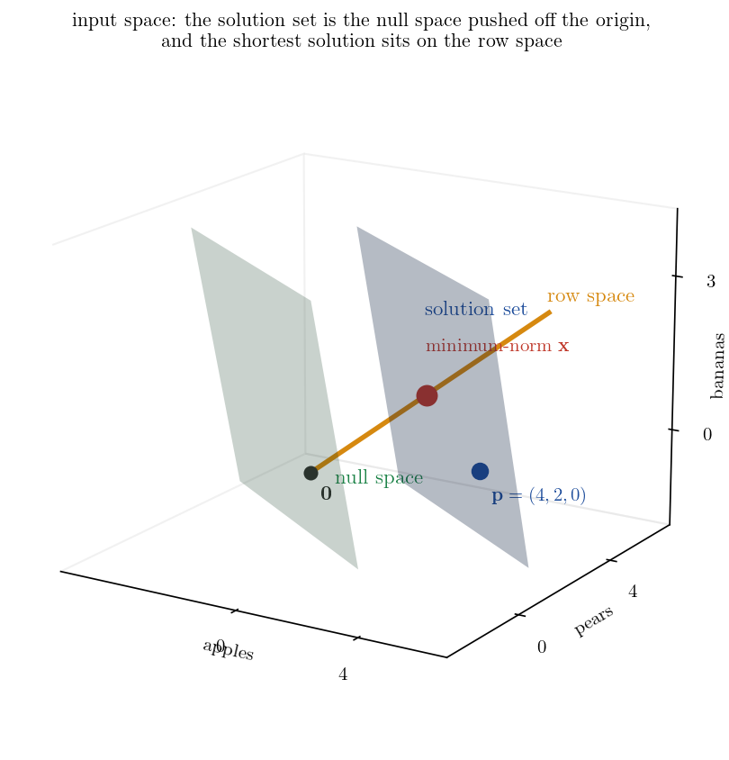
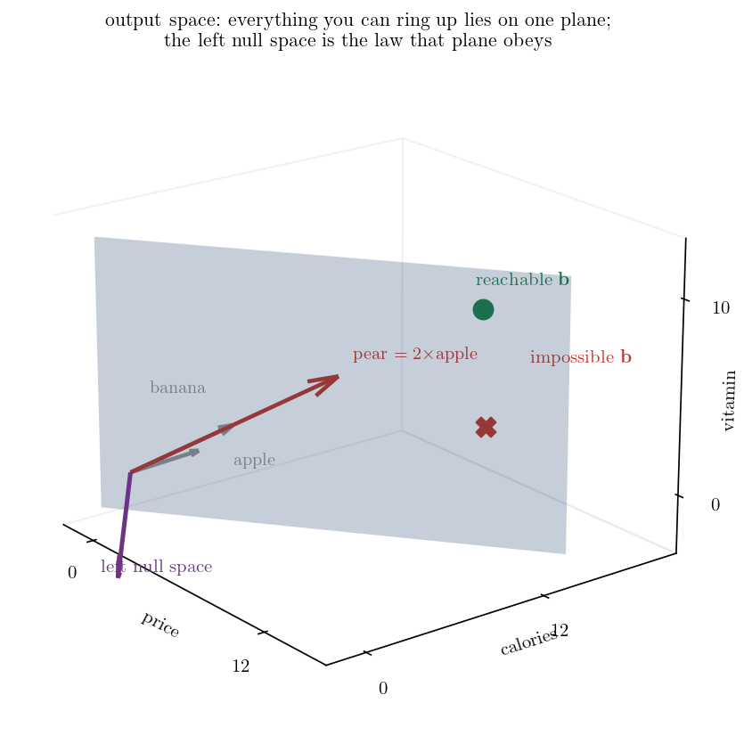
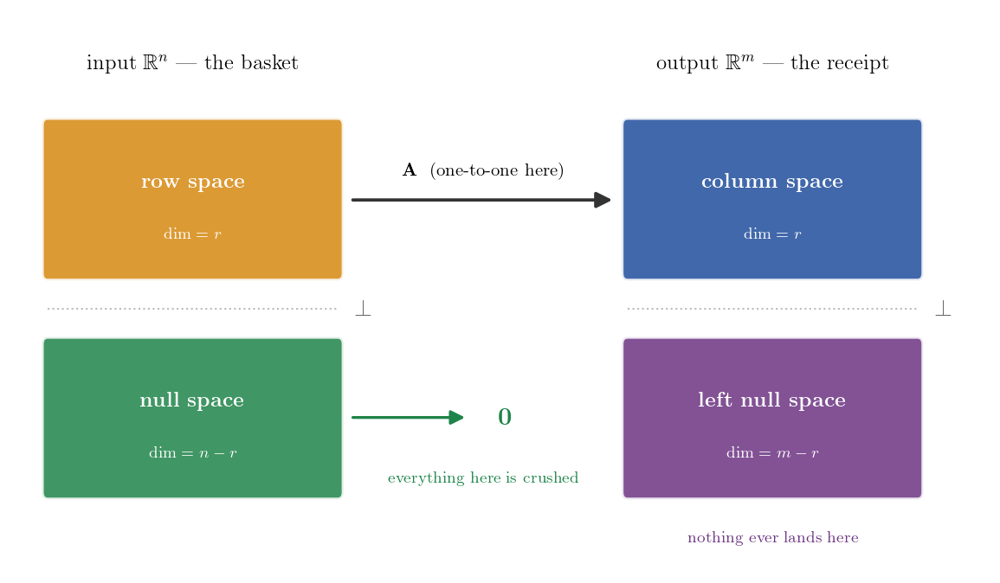
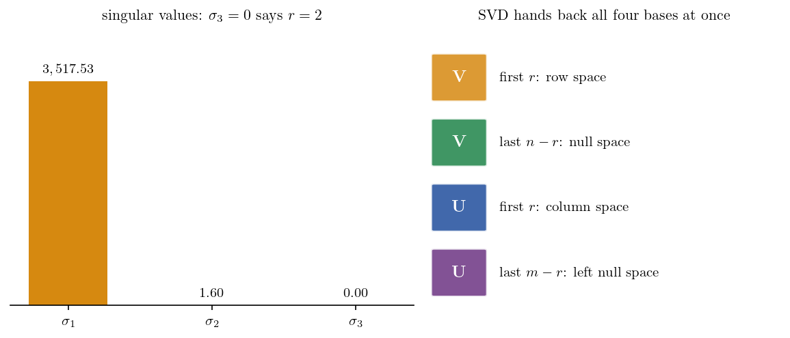

> 두 진행자가 주고받는 대본을 거의 그대로 싣고, 개념이 나오는 자리마다 수식과 실측 숫자와 그림을 끼워 넣었습니다. **H** 는 진행자, **G** 는 해설자입니다.

## 1. 프롤로그 — 지폐 한 장과 과일 가게

**H.** 상상해 보시죠. 여러분은 지금 동네 과일가게 앞에 딱 서 있습니다. 주머니에는 정확히 지폐 한 장이 들어 있고요.

**G.** 뭔가 아주 흥미로운 미션이 주어질 것 같은 상황이네요.

**H.** 맞습니다. 오늘 여러분의 미션은 아주 단순해요. 이 돈을 진짜 한 푼도 남기지 않고 딱 떨어지게 과일을 사는 겁니다. 과일 종류는 산처럼 쌓여 있는데, 여러분이 지켜야 할 조건은 오직 총액 하나뿐이죠.

**G.** 아, 그거 은근히 쉽지 않겠는데요. 선택할 수 있는 과일 변수가 너무 많잖아요.

**H.** 그러니까요. 환영합니다 여러분. 쏟아지는 정보의 홍수 속에서 복잡하고 난해한 지식들을 여러분만을 위해 가장 쉽고 완벽하게 압축해 드리는 오늘의 심층 분석 시간입니다.

**G.** 네, 오늘도 정말 기대가 됩니다.

**H.** 오늘 우리는 이 평범한 과일가게의 장바구니 하나로 데이터 과학과 기계학습의 근간이 되는 **선형대수학의 4대 부분공간**, 그리고 **특이값 분해(SVD)** 를 완벽하게 해부해 볼 겁니다. 자, 이 내용을 한번 풀어 볼까요?

**한 문단으로 먼저**

선형대수학을 배우는 **궁극적인 목적**은 단순히 복잡한 행렬 계산을 수행하는 데 있지 않습니다. 진짜 이유는 수많은 가능한 답 중에서 내게 가장 유리한(최적화된) 답을 골라내기 위해서입니다. 선형대수학은 이 복잡한 해의 구조를 두 쌍의 **룸메이트 공간**으로 나누어 설명합니다. 입력 쪽에 행공간과 영공간이 함께 살고, 출력 쪽에 컬럼스페이스와 좌영공간이 함께 삽니다.

그래서 일반해를 모두 알아야 합니다. 단순히 목표를 맞추는 것을 넘어, 무수히 많은 해 중에서 "가장 무게가 가벼운 장바구니" 를 찾거나 "탄소 배출을 최소화하는 조합" 을 골라내는 최적화가 가능해지기 때문입니다. 일반해는 우리가 선택할 수 있는 모든 가능성의 지도를 제공하며, 그중에서 가장 **가성비** 좋은 최적의 해를 찾을 수 있게 해 주는 **마스터 플랜**입니다.

**실측 준비**

이 대화를 끝까지 숫자로 따라갈 수 있도록 가게의 가격표를 먼저 고정해 둡니다. 이 가게의 과일은 가격뿐 아니라 칼로리와 비타민까지 함께 달고 다닙니다.

| | 가격 | 칼로리 | 비타민 |
|---|---|---|---|
| 사과 | 1,500원 | 150 kcal | 10 |
| 배 | 3,000원 | 300 kcal | 20 |
| 바나나 | 1,000원 | 100 kcal | 5 |

목표 금액은 **12,000원**입니다.

원음이 든 스펙(사과 1,000원·50kcal·비타민 10, 배 2,000원·100kcal·비타민 20, 바나나 500원·80kcal·비타민 5, 목표 1만 원)은 자기가 말한 조건들과 어긋납니다. 사과 4개와 배 2개가 8,000원이고, 배 1개와 바나나 3개의 값이 다르며, 바나나는 100원당 16kcal 라 뒤에 나올 법칙을 깹니다. 위 표는 **원음의 네 조건(배 $=2\times$사과 · 사과 2개 $=$ 배 1개 · 배 1개 $=$ 바나나 3개 · 100원당 10kcal)을 전부 동시에 만족시키는 유일한 스펙**이고, 그때 사과 4개와 배 2개가 12,000원이 됩니다.

## 2. 무수히 많은 정답, 그리고 베이스캠프

**G.** 좋습니다. 우리가 방금 설정한 이 상황, 그러니까 조건은 하나인데 선택할 수 있는 변수는 무수히 많은 이 상태를 어떻게 이해해야 할까요?

**H.** 우리가 학창 시절에 주로 풀었던 수학 문제들을 떠올려 보면, 변수의 개수랑 제약 조건 그러니까 방정식의 개수가 딱 맞아떨어지는 상황이었거든요.

**G.** 아, 그렇죠. 미지수가 두 개면 식도 무조건 두 개인 식이죠.

**H.** 네. 하지만 현실의 데이터는 전혀 그렇지 않습니다. 방금 말씀하신 과일가게의 상황처럼 지켜야 할 조건은 총액 딱 하나인데, 선택할 수 있는 과일 변수는 수십 가지가 넘잖아요. 사과, 배, 포도, 귤 엄청 많죠. 이런 상황을 우리는 **과소 결정 시스템**이라고 부릅니다. 제약보다 자유도가 훨씬 높기 때문에 단 하나의 유일한 정답이 존재하는 게 아니라, 무수히 많은 정답의 가능성이 열려 있는 상태인 거죠.

**G.** 아, 무수히 많은 정답이라. 그럼 이때 우리가 가장 먼저 해야 할 일은 뭘까요?

**H.** 일단 이 시스템이 애초에 달성 가능한 목표를 가지고 있는지, 그러니까 **실현 가능성**을 검증하는 겁니다.

**G.** 그러니까 일단 이것저것 장바구니에 막 담아보면서 총액이라는 조건이 물리적으로 맞춰지는지부터 확인해야 한다는 거군요.

**H.** 맞아요, 바로 그겁니다.

**수식으로**

계산대는 장바구니를 받아 금액 하나를 뱉는 사상입니다. 사과·배·바나나를 각각 $x_1,x_2,x_3$ 개 담으면

$$
\mathbf{A}_1=\begin{pmatrix}1500 & 3000 & 1000\end{pmatrix}, \qquad \mathbf{A}_1\mathbf{x}=1500x_1+3000x_2+1000x_3=12000
$$

식은 하나, 미지수는 셋입니다. 이것이 **부족 결정 시스템**(underdetermined system)이고, 대본이 말한 과소 결정 시스템과 같은 말입니다.

**G.** 만약 제가 사과 네 개랑 배 두 개를 담았더니 운 좋게 정확히 목표 금액이 나왔다고 가정해 볼게요. 미션은 달성했네요. 수학적으로는 이게 어떤 의미를 가지나요?

**H.** 바로 그 지점이 전체 공간을 탐험하기 위한 **첫 번째 베이스캠프를 구축한 순간**입니다. 사과 네 개와 배 두 개라는 특정한 조합을 **특수해**라고 부르거든요.

**G.** 아, 특수해. 들어본 기억이 납니다.

**H.** 네. 이 특수해는 이 시스템에 최소한 하나의 현실적인 답이 존재한다는 걸 증명하는 역할을 해요. 아무리 훌륭한 시스템을 설계했더라도 이 특수해가 단 하나도 없다면, 애초에 도달할 수 없는 **허상의 목표**를 쫓고 있다는 뜻이 되니까요.

**G.** 네, 맞습니다. 우리가 흔히 선형대수학 배울 때 수식으로만 접하던 특수해가, 사실은 거대한 가능성의 세계로 진입하기 위한 **입장권** 같은 거였군요.

**실측**

$$
\mathbf{p}=(4,\,2,\,0), \qquad \mathbf{A}_1\mathbf{p}=1500\times 4+3000\times 2+1000\times 0=12000 \quad\checkmark
$$

## 3. 영공간 — 0원짜리 교환

**H.** 정확한 비유네요. 하지만 여기서 합리적인 의문이 하나 듭니다. 아니, 사과 네 개 배 두 개로 목표를 맞췄으면 미션 끝난 거 아닌가요? 목표를 달성했는데 왜 굳이 다른 조합들을 찾기 위해서 더 깊은 수학적 공간을 탐구해야 하는 걸까요?

**G.** 아주 현실적인 관점이십니다. 만약 우리의 목표가 단순히 "어떻게든 총액만 쓰기" 라면 거기서 멈춰도 됩니다. 하지만 데이터 과학이나 머신러닝의 세계에서는 **단순히 답을 찾는 걸 넘어서 가장 최적화된 답을 찾는 게** 핵심이잖아요. 특수해 하나만 딱 쥐고 있다면 무수히 많은 다른 훌륭한 대안들을 모두 놓치게 되거든요.

**H.** 아, 최적화를 위해서 전체 지도가 필요하다는 거군요.

**G.** 맞아요. 여기서 바로 **영공간**이라는 아주 매력적인 개념이 등장합니다.

**H.** 영공간이요? 널 스페이스.

**G.** 네. 영공간은 아주 쉽게 말해서, 우리가 이미 달성한 결과 그러니까 그 12,000원을 전혀 훼손하지 않으면서 장바구니 안에서 내부적으로 일어나는 **허용된 변화**를 의미합니다.

**H.** 결과에 영향을 주지 않는 내부의 변화. 아, 이런 거군요. 장바구니를 가만히 들여다 보니까 **사과 두 개의 가격이 배 한 개의 가격과 완전히 똑같다**는 사실을 제가 깨달은 거예요. 그렇다면 제가 장바구니에서 사과 두 개를 빼내고 대신 배 한 개를 새로 집어넣는 행동을 취해도, 계산대에서 내야 할 총 결제 금액은 정확히 **0원 변하게** 됩니다. 여전히 목표는 단단하게 유지되는 거고요.

**G.** 그 과정을 정확히 짚어주셨어요. **결과를 0으로 만드는 조작**, 그것이 바로 영공간의 본질입니다.

**H.** 아, 결과를 0으로 만드는 조작.

**G.** 네. 사과 네 개, 배 두 개라는 첫 번째 베이스캠프에다가 방금 말씀하신 "사과 두 개 빼고 배 한 개 넣기" 라는 0원짜리 변화를 우리가 원하는 만큼 자유롭게 더하거나 빼는 겁니다.

**H.** 계속 교환을 하는 거군요.

**G.** 그렇죠. 이 과정을 거치면 비로소 이 시스템에서 가능한 모든 장바구니 조합, 즉 **일반해의 전체 지도**를 완성할 수 있게 됩니다.

**수식으로**

$$
\ker(\mathbf{A}_1):=\bigl\{\mathbf{v} : \mathbf{A}_1\mathbf{v}=0\bigr\}
$$

해 두 개를 빼 보면 왜 이 집합이 등장하는지가 바로 나옵니다.

$$
\mathbf{A}_1\mathbf{p}=12000, \quad \mathbf{A}_1\mathbf{q}=12000 \qquad\Longrightarrow\qquad \mathbf{A}_1(\mathbf{q}-\mathbf{p})=0
$$

해와 해의 차이는 언제나 커널 안에 있습니다. 거꾸로 $\mathbf{v}\in\ker(\mathbf{A}_1)$ 이면 $\mathbf{A}_1(\mathbf{p}+\mathbf{v})=12000+0$ 이라 $\mathbf{p}+\mathbf{v}$ 도 해입니다. 둘을 합치면 해집합 전체가 한 줄로 적힙니다.

$$
\bigl\{\mathbf{x}:\mathbf{A}_1\mathbf{x}=12000\bigr\}=\underbrace{\mathbf{p}}_{\text{특수해}}+\underbrace{\ker(\mathbf{A}_1)}_{\text{동차해 전체}}
$$

사과 두 개와 배 한 개를 맞바꾸는 행위가 실제로 커널 안에 있는지 확인해 보면

$$
\mathbf{u}_1=(-2,\,1,\,0), \qquad \mathbf{A}_1\mathbf{u}_1=-3000+3000+0=0 \quad\checkmark
$$

**H.** 그 지도를 확보한다는 게 왜 그렇게 중요한지 이제 좀 명확해지네요.

**G.** 어떤 부분에서요?

**H.** 우리가 단순히 과일을 사는 게 목적이 아니라, 만약 "총액을 맞추면서도 가장 가벼운 장바구니를 만들어라" 혹은 "탄소 배출이 가장 적게 나오는 과일 조합을 찾아라" 같은 복합적인 **최적화**를 수행해야 한다면, 이 수많은 대안들의 목록이 반드시 필요하겠군요.

**G.** 정확합니다.

**H.** 머신러닝에서 과적합을 막기 위해서 파라미터의 크기 그러니까 **노름이 가장 작은 해**를 찾는 원리도 이 영공간을 탐색하는 과정이랑 완전히 맞닿아 있겠네요.

**G.** 맞아요. 모델의 예측 오차를 최소화하는 정답은 무수히 많지만, 그중에서 가장 단순하고 안정적인 모델을 골라내는 것이 바로 이 영공간이 제공하는 **잉여 자유도**를 활용하는 방법입니다.

**실측 — 같은 12,000원, 다른 장바구니**

$\mathbf{p}$ 에 $\mathbf{u}_1$ 과 $\mathbf{u}_2=(0,-1,3)$ 을 섞어 만든 조합들입니다. 금액은 전부 같은데 개수와 노름이 갈립니다.

| 장바구니 (사과, 배, 바나나) | 금액 | 개수 | 노름 |
|---|---|---|---|
| $(4,\,2,\,0)$ | 12,000 | 6 | 4.4721 |
| $(2,\,3,\,0)$ | 12,000 | 5 | 3.6056 |
| $(0,\,4,\,0)$ | 12,000 | **4** | 4.0000 |
| $(4,\,1,\,3)$ | 12,000 | 8 | 5.0990 |
| $(0,\,3,\,3)$ | 12,000 | 6 | 4.2426 |
| $(1.4694,\,2.9388,\,0.9796)$ | 12,000 | — | **3.4286** |

맨 아래가 **최소노름 해**입니다. 목표를 맞추는 무수한 답 중에서 "가장 작은" 하나를 실제로 골라낸 것이고, 베이스캠프 하나만 쥐고 있었다면 이 비교 자체가 불가능합니다.

## 4. 기저와 널리티 — 최소한의 기본 동작

**H.** 야, 이거 재밌네요. 자, 그렇다면 우리의 장바구니 시스템을 조금 더 확장해 볼까요? 만약 과일가게에 사과랑 배뿐만 아니라 **바나나까지** 추가되었다고 상상해 보시죠.

**G.** 오, 변수가 3차원으로 늘어난 거군요. 바나나가 추가되면 영공간의 범위도 훨씬 넓어지겠네요.

**H.** 엄청나게 넓어지죠.

**G.** 사과랑 배를 교환하는 것뿐만 아니라 바나나랑 사과를 바꾸거나 셋을 동시에 섞어서 0원을 만드는 등 무수히 많은 교환 방식이 폭발적으로 생겨날 텐데, 이걸 전부 추적하는 건 불가능에 가깝지 않나요?

**H.** 언뜻 보면 무질서하게 팽창하는 것처럼 보이잖아요. 하지만 수학은 항상 그 속에서 **최소한의 질서**를 찾아냅니다.

**G.** 어떻게 질서를 찾죠?

**H.** 여기서 매력적인 부분은, 그 수많은 0원 교환법들도 사실 분석해 보면 아주 소수의 **독립적인 기본 동작**들을 이리저리 조합한 것에 불과하거든요.

**G.** 기본 동작이요?

**H.** 네. 이 독립적이고 핵심적인 기본 동작들의 세트를 우리는 영공간의 **기저**(basis)라고 부릅니다.

**G.** 그러니까 그 수만 가지 교환법을 다 외울 필요 없이, 예를 들어 **기본 동작 A** 는 사과 두 개를 빼고 배 한 개를 넣는 행동, 그리고 **기본 동작 B** 는 배 한 개를 빼고 바나나 세 개를 넣는 행동, 이렇게 정의해 두는 거군요.

**H.** 맞습니다, 딱 그거예요. 이 두 가지 동작 묶음만 가지고 있으면 이들을 적절히 섞어서 목표를 유지하는 모든 경우의 수를 다 만들어낼 수 있다는 거네요.

**G.** 네, 맞습니다. 그리고 방금 두 가지 기본 동작을 말씀하셨잖아요. **2 라는 숫자가 바로 이 장바구니 시스템이 가진 영공간의 차원, 즉 널리티**가 됩니다.

**H.** 아, 널리티.

**G.** 네. 우리가 결과를 망가뜨리지 않고 마음대로 조작할 수 있는 **자유도의 크기**가 바로 2차원이라는 뜻이죠.

**수식으로**

$$
\mathbf{u}_1=\begin{pmatrix}-2\\1\\0\end{pmatrix}\ \text{(기본 동작 A)}, \qquad \mathbf{u}_2=\begin{pmatrix}0\\-1\\3\end{pmatrix}\ \text{(기본 동작 B)}
$$

$$
\mathbf{A}_1\mathbf{u}_1=-3000+3000=0, \qquad \mathbf{A}_1\mathbf{u}_2=-3000+3000=0
$$

대본이 든 "사과 4개 빼고 배 2개 넣기" 나 "사과 2개 빼고 배 2개 넣고 바나나 3개 빼기" 같은 복잡한 교환도 전부 이 둘의 조합입니다.

$$
(-4,\,2,\,0)=2\mathbf{u}_1, \qquad (-2,\,2,\,-3)=\mathbf{u}_1-\mathbf{u}_2
$$

일반해는 이렇게 한 줄로 닫힙니다.

$$
\mathbf{x}=\mathbf{p}+s\,\mathbf{u}_1+t\,\mathbf{u}_2, \qquad s,t\in\mathbb{R}
$$

**입력 공간을 그림으로 본 것입니다.** 초록 평면이 영공간이고, 그것을 원점 밖으로 밀어 놓은 파란 평면이 해집합입니다. 주황 직선은 잠시 뒤에 나올 행공간이고, 두 평면과 수직입니다. 최소노름 해가 정확히 그 주황 직선 위에 앉아 있습니다.

## 5. 랭크와 랭크-널리티 정리

**H.** 자유도의 크기인 널리티가 2차원이다. 그렇다면 입력된 정보가 결과를 만들어내는 데 실제로 기여하는 차원인 그 **랭크**의 개념도 자연스럽게 도출되겠군요.

**G.** 눈치가 아주 빠르신데요. 우리가 지금 사과·배·바나나라는 3차원의 변수를 장바구니에 담아서 계산대라는 시스템에 입력으로 쫙 밀어넣고 있잖아요. 하지만 계산대가 최종적으로 우리에게 보여주는 유의미한 결과물은 무엇인가 생각해 보면 아주 명확해지네요.

**H.** 그 유의미한 결과물이 과연 뭘까요? 과일의 색깔이나 당도 같은 정보일까요?

**G.** 아니요. 우리가 처음에 맞추기로 한 유일한 조건, 바로 **영수증에 딱 찍히는 총 결제 금액 단 하나**뿐입니다.

**H.** 그렇죠. 제가 장바구니 안에서 과일을 3차원으로 아무리 복잡하게 섞어도 계산대라는 함수를 통과하고 나면 결국 "얼마인가요" 라는 1차원적인 결과 선상에만 뚝 떨어지게 되는 거잖아요. 그렇다면 이 시스템의 랭크, 즉 유효한 출력 차원은 1차원이 되겠군요.

**G.** 완벽한 통찰입니다. 그리고 방금 여러분은 선형대수학에서 가장 우아한 공식 중 하나인 **랭크-널리티 정리**를 기하학적으로 완전히 증명해 내셨어요.

**H.** 제가요?

**G.** 네. 변수의 총 개수 $n$, 여기서는 과일 3종류잖아요. 이 숫자는 언제나 랭크 더하기 널리티와 정확히 일치해야 합니다.

**H.** 아, 1이라는 결정된 결과물 그러니까 랭크에 2라는 허용된 자유도 널리티를 딱 더하면 처음에 투입한 전체 변수인 3이 된다. 와, 단순한 덧셈을 넘어선 완벽한 **차원 보존의 법칙**이네요.

**G.** 정말 아름답죠. 시스템에 투입된 변수들은 **뼈대**가 되어서 결과물을 형성하는 데 쓰이거나, 아니면 결과에 영향을 미치지 못하고 **자유도**로 빠져나가거나, 반드시 이 둘 중 하나의 운명을 겪으면서 전체 차원을 엄격하게 보존한다는 게 참 아름답습니다.

**수식으로**

$$
\operatorname{Rank}(\mathbf{A})+\operatorname{Nullity}(\mathbf{A})=n
$$

- $n$ (전체 변수의 수): 처음에 쥐고 있던 자원의 개수 — 사과, 배, 바나나 $=3$
- $\operatorname{Rank}(\mathbf{A})$: 계산대를 거쳐 살아남은 의미 있는 결과의 차원 — 총 결제 금액 $=1$
- $\operatorname{Nullity}(\mathbf{A})$: 결과에 영향을 주지 못하고 0으로 찌그러졌지만 그 안에서 마음대로 움직일 수 있는 잉여 자유도의 차원 — 기본 동작 A, B $=2$

$$
\underbrace{1}_{\text{결정된 결과물}}+\underbrace{2}_{\text{자유로운 교환 동작}}=\underbrace{3}_{\text{처음 가진 과일 종류}}
$$

이것이 **차원(정보) 보존의 법칙**입니다.

## 6. 출력 공간 — 컬럼스페이스와 랭크의 비극

**G.** 이 보존의 법칙을 이해하는 건 데이터를 다루는 데 있어서 매우 강력한 직관을 제공합니다. 자, 지금까지는 우리가 주로 **입력**, 즉 장바구니 안에서 과일들을 어떻게 조합하느냐에 집중했거든요.

**H.** 네, 장바구니 얘기를 계속 했죠. 이제는 시선을 조금 옮겨서 **출력된 결과물, 즉 영수증이 지배하는 공간**으로 넘어가 볼까요?

**G.** 좋습니다. 과일가게 사장님이 시스템을 업그레이드해서, 이제 영수증에 총 결제 금액뿐만 아니라 담긴 과일들의 **총 칼로리** 그리고 **총 비타민** 수치까지 세 개의 항목이 출력된다고 한번 가정해 봅시다.

**H.** 출력 공간 자체가 1차원에서 3차원으로 확장이 된 거군요. 여기서부터 선형대수학의 세 번째 공간인 **컬럼스페이스**(열공간)가 무대로 올라오겠네요.

**G.** 네, 맞습니다. 컬럼스페이스는 우리가 과일들을 무한히 이리저리 섞어서 계산대에 올렸을 때 이 3차원 영수증에 최종적으로 찍혀 나올 수 있는 **모든 가능한 결과값**, 즉 도달 가능한 한계 영역을 뜻하는 거 맞죠? 과일 하나하나가 고유한 특성을 담은 **열벡터**가 되는 셈이고요.

**H.** 정확합니다.

**수식으로**

과일 하나가 가진 고유 스펙이 행렬의 한 열이 됩니다.

$$
\mathbf{A}=\begin{pmatrix}1500 & 3000 & 1000\\ 150 & 300 & 100\\ 10 & 20 & 5\end{pmatrix} \qquad \text{(행: 금액·칼로리·비타민 / 열: 사과·배·바나나)}
$$

**G.** 그럼 입력 변수도 세 개고 영수증의 출력 항목도 세 개니까, 우리는 3차원 공간상에 어떤 영수증 결과값이든 마음대로 다 만들어 낼 수 있을까요?

**H.** 스펙을 가만히 살펴보니까 아주 흥미로운 패턴이 하나 보입니다.

**G.** 어떤 패턴이죠?

**H.** **배의 스펙이 정확히 사과 스펙의 2배**잖아요.

**G.** 아, 예리하시네요. 수학적 개념을 빌리자면 이 시스템 안에서 배는 사과와 **선형 종속** 관계에 있습니다. 즉 배는 단지 **거대한 사과**일 뿐이지, 출력 공간에서 완전히 새로운 차원의 방향성을 만들어내는 데는 아무런 기여를 하지 못하는 셈이죠. 그 통찰이 바로 데이터의 실질적인 차원을 파악하는 핵심이에요. 겉보기에는 사과, 배, 바나나 이렇게 세 개의 축이 존재하는 것 같지만, 배는 **사과가 만들어내는 궤도에 단 한 치도 벗어나지 못하거든요.** 완전히 종속되어 있으니까요.

**H.** 맞습니다. 따라서 이 과일가게 시스템이 실제로 뻗어나갈 수 있는 유효한 랭크는 3이 아니라 **2로 축소**가 됩니다. 영수증 정보는 3차원이지만 우리가 만들어 낼 수 있는 실제 결과물은 3차원 공간 전체를 채우지 못하고 **2차원 평면(납작한 종이 한 장) 위에 갇히게** 되는 거죠.

**실측 — 랭크의 기하학적 비극**

$$
\text{배 열}=(3000,\,300,\,20)=2\times(1500,\,150,\,10)=2\times\text{사과 열}
$$

$$
n=3, \qquad \operatorname{Rank}(\mathbf{A})=2, \qquad \operatorname{Nullity}(\mathbf{A})=1, \qquad \dim(\text{좌영공간})=m-r=1
$$

노름으로 재도 배는 사과의 정확히 2배입니다 — $\|\text{사과 열}\|=1507.51$, $\|\text{배 열}\|=3015.03$.

## 7. 좌영공간 — 절대 깰 수 없는 물리 법칙

**G.** 도달 가능한 영역이 제한된다는 건 역으로 **도달 불가능한 목표도 존재한다**는 뜻이군요. 여기서 제가 조금 짓궂은 진상 손님이 되어서 불가능한 목표를 한번 요구해 보겠습니다.

**H.** 네, 한번 해 보시죠.

**G.** "사장님, 총액은 딱 5,000원에 맞추고 칼로리는 2,000kcal 로 아주 든든하게 하되, 제가 **비타민 알레르기**가 있어서 총 비타민은 반드시 0으로 맞춰 주세요" 라고 주문한다면 어떨까요? 이 영수증 조합은 달성 가능한가요?

**H.** 물리적으로 절대 불가능한 요구입니다. 왜냐하면 손님이 제시한 그 5,000원·2,000kcal·비타민 0 이라는 타깃 벡터는 이 과일가게 시스템이 허용하는 **컬럼스페이스 평면 바깥에** 존재하기 때문이에요.

**G.** 아, 평면 바깥에.

**H.** 네, 해가 하나도 존재하지 않는 **불능** 상태에 빠지는 거죠. 그런데 우리가 이 직관적인 불가능성을 수학적으로 어떻게 완벽하게 증명할 수 있을까요? 여기서 네 번째 공간인 **좌영공간**이 등장합니다.

**G.** 좌영공간. 보통 수식으로만 접하면 너무 추상적인데, 이 과일가게 비유에 대입하면 **영수증이 절대 깰 수 없는 내재적 제약 조건** 혹은 일종의 **물리 법칙**이라고 볼 수 있겠네요.

**H.** 맞아요, 아주 좋은 해석입니다. 예를 들어서 이 가게에서 파는 모든 과일들이 선천적으로 **금액 100원당 정확히 10kcal** 를 동반한다는 어떤 숨겨진 비율 규칙을 공유하고 있다고 상상해 보죠. 그렇다면 제가 과일을 어떻게 섞든 간에 영수증에는 반드시 "칼로리 빼기 금액 곱하기 0.1 은 0이다" 라는 룰이 성립해야만 합니다. 그 숨은 룰 자체를 벡터로 표현한 것, 그런 제약 조건의 벡터들이 모여 사는 곳이 바로 이 좌영공간이에요.

**G.** 그렇군요.

**H.** 이 좌영공간의 가장 핵심적인 성질은, 우리가 앞서 만든 그 도달 가능한 영역 즉 **컬럼스페이스와 기하학적으로 완벽하게 90도를 이루면서 직교**한다는 점입니다.

**수식으로**

$$
\mathbf{y}^{\top}=\begin{pmatrix}-0.1 & 1 & 0\end{pmatrix}, \qquad \mathbf{y}^{\top}\mathbf{A}=\begin{pmatrix}0 & 0 & 0\end{pmatrix}
$$

세 열 모두에 대해 $-0.1\times(\text{금액})+1\times(\text{칼로리})=0$ 이 성립합니다. 예를 들어 사과 열은 $-0.1\times 1500+150=0$ 입니다.

도달 가능한 영수증인지 아닌지는 이 벡터와 내적 한 번으로 판정됩니다.

$$
\mathbf{y}\cdot(12000,\,1200,\,80)=-1200+1200+0=0 \quad\checkmark\ \text{(사과 4 + 배 2 의 영수증)}
$$

$$
\mathbf{y}\cdot(5000,\,2000,\,0)=(-0.1\times 5000)+(1\times 2000)+(0\times 0)=1500\neq 0 \quad\times
$$

**G.** 직교한다는 것이 현실 세계에서는 물리적 모순을 의미하는 거군요. 아까 제가 5,000원에 2,000kcal 를 달라고 했던 진상 손님의 요구를 생각해 보면, 금액 100원당 10kcal 라는 좌영공간의 룰에 따르면 5,000원이면 당연히 500kcal 가 되어야 정상이잖아요.

**H.** 그렇죠?

**G.** 그런데 2,000kcal 를 요구했으니 이 가게를 지배하는 숨은 물리 법칙과 정면으로 충돌하는 겁니다. 내적을 계산할 것도 없이, 타깃이 시스템의 근본적인 룰과 직교하지 않는다는 것 즉 컬럼스페이스 바깥에 있다는 명백한 증거네요.

**H.** 그 직관적인 모순을 찾아내는 것이 좌영공간의 강력함입니다.

**출력 공간을 그림으로 본 것입니다.** 회색 평면이 만들어낼 수 있는 영수증 전부, 즉 컬럼스페이스입니다. 사과·배·바나나 화살표가 전부 그 평면 안에 누워 있고, 배는 사과와 같은 방향으로 두 배 길 뿐입니다. 보라색 화살표가 평면에 수직인 좌영공간이고, 붉은 X 로 찍힌 진상 손님의 요구는 평면에서 떨어져 있습니다.

**실측 — 계산대를 업그레이드하면 자유가 줄어든다**

같은 랭크-널리티 정리를 두 계산대에 각각 대입해 보면 이렇게 갈립니다.

| 계산대 | $n$ | 랭크 | 널리티 | 살아남은 기본 동작 |
|---|---|---|---|---|
| 금액만 | 3 | 1 | 2 | A, B |
| 금액·칼로리·비타민 | 3 | 2 | 1 | **A 만** |

칼로리는 금액에 딸린 정보라 새 제약을 걸지 못하지만 **비타민은 겁니다.**

$$
\mathbf{A}\mathbf{u}_1=(0,\,0,\,0) \qquad\qquad \mathbf{A}\mathbf{u}_2=(0,\,0,\,-5)
$$

배 1개를 빼고 바나나 3개를 넣으면 금액도 칼로리도 그대로인데 비타민이 5만큼 줄어듭니다. 기본 동작 B 가 더 이상 공짜가 아닙니다.

## 8. 행공간 — 순수한 노력, 그리고 나침반

**H.** 자, 이제 우리는 출력 공간 그 영수증이 가진 도달 가능한 한계와 깰 수 없는 물리 법칙을 모두 확인했습니다.

**G.** 네, 출력 쪽은 다 정리가 됐네요. 다시 우리의 원래 위치인 입력 공간, 즉 장바구니로 돌아가서 마지막 퍼즐 조각을 맞춰 볼 차례입니다. 앞서 우리가 영공간을 "결과를 1원도 바꾸지 못하는 내부의 잉여 변화" 이라고 정의했었잖아요.

**H.** 네, 0원 교환법이요.

**G.** 그렇다면 논리적으로 그것과 완벽하게 반대되는 성질을 가진 공간도 존재해야 하지 않을까요?

**H.** 당연하죠. **헛수고**가 있다면 100% 결과에 기여하는 **순수한 노력**의 공간도 있어야 합니다. 그것이 바로 4대 부분공간의 마지막을 장식하는 **행공간**(row space)이군요.

**G.** 맞습니다. 행공간은 출력 쪽에 사는 컬럼스페이스와 다르게, 영공간과 함께 **입력 쪽인 장바구니 공간에 거주**하고 있는 거네요.

**H.** 그렇습니다. 우리가 장바구니에 아무렇게나 과일 벡터 $\mathbf{x}$ 를 딱 집어넣더라도, 수학적으로 이 벡터는 항상 두 가지의 명확한 성분으로 쪼개집니다.

**G.** 두 가지 성분으로요?

**H.** 네. 영수증의 숫자를 실질적으로 움직이는 **유효한 순수 노력, 즉 행공간 성분**과, 아무리 요동쳐도 결과에 영향을 주지 못하고 자기들끼리 상쇄되어서 날아가는 **헛수고, 즉 영공간 성분**으로 분해되죠. 그리고 이 두 공간은 장바구니 안에서 완벽하게 직교하고 있습니다.

**수식으로**

$$
\mathbf{x}=\underbrace{\mathbf{x}_{\text{row}}}_{\text{순수 노력}}+\underbrace{\mathbf{x}_{\text{null}}}_{\text{헛수고}}, \qquad \mathbf{x}_{\text{row}}\perp\mathbf{x}_{\text{null}}
$$

두 공간에 한 줄짜리 별명을 붙이면 이렇습니다. 행공간은 **"진짜 유효한 노력"**, 영공간은 **"결과에 영향이 없는 잉여 노력"**.

| 구분 | 의미 | 결과에 미치는 영향 | 기하학적 특징 |
|---|---|---|---|
| 행공간 | 유효한 노력 성분 | 영수증 숫자를 직접적으로 변화시킴 | 영공간과 직교 |
| 영공간 | 잉여·자유도 성분 | 결과값에 변화를 주지 않음 (상쇄됨) | 행공간과 직교 |

**G.** 그래서 이 모든 게 대체 무슨 의미일까요? 우리의 장바구니가 직교하는 두 성분으로 딱 쪼개진다는 이 우아한 기하학적 사실이, 데이터를 다루는 현실에서 우리에게 어떤 실질적인 무기를 쥐어 주는 건가요?

**H.** 아주 중요한 무기죠. **가장 빠르고 효율적으로 목표에 도달하는 최단 경로를 알려주는 나침반**이 됩니다.

**G.** 나침반요?

**H.** 영수증의 결과를 진짜 바꾸고 싶다면 영공간 방향으로는 단 한 발자국도 움직일 필요가 없어요. 오직 직교하는 **행공간 방향으로만** 쭉 전진해야 하죠.

**G.** 아, 헛수고는 빼고요.

**H.** 그렇죠. 만약 목표를 달성하는 수천 가지 장바구니 중에서 **영공간 성분이 정확히 0% 인**, 오로지 순수한 행공간만으로 이루어진 장바구니를 골라낸다면 어떻게 될까요?

**G.** 군더더기가 하나도 없는 상태가 되겠네요.

**H.** 맞습니다. 그것이 바로 군더더기 없이 가장 무게가 가벼운, 기계학습이 그토록 찾아 헤매는 **최적화의 결정체인 최소 노름 해**가 됩니다.

**실측 — 최소 노름 해가 정말 행공간 위에 있는가**

이 계산대의 행공간은 가격 벡터 $(1500,\,3000,\,1000)$ 이 그리는 직선입니다. 최소노름 해를 그 벡터로 나눠 보면

$$
\frac{1.4694}{1500}=\frac{2.9388}{3000}=\frac{0.9796}{1000}=0.00097959
$$

세 비율이 정확히 같습니다. 최소노름 해는 가격 벡터의 상수배, 즉 **행공간 위의 점**입니다. 영공간 성분이 0% 라는 말이 이 한 줄로 확인됩니다.

**G.** 헛수고를 완전히 발라낸 순수한 핵심의 상태. 자, 지금까지 우리는 장바구니 속의 순수 노력과 헛수고, 그리고 영수증 공간의 도달 가능한 가능성과 내재적 한계라는 **네 개의 방**을 모두 들어갔습니다.

**네 개의 방을 한 장에 담은 것입니다.** 입력 쪽에서 행공간과 영공간이 직교하고, 출력 쪽에서 컬럼스페이스와 좌영공간이 직교합니다. $\mathbf{A}$ 는 행공간을 컬럼스페이스로 일대일로 옮기고, 영공간은 통째로 $\mathbf{0}$ 으로 뭉갭니다. 좌영공간에는 아무것도 도착하지 않습니다.

$$
n=\underbrace{r}_{\text{행공간}}+\underbrace{n-r}_{\text{영공간}}, \qquad m=\underbrace{r}_{\text{컬럼스페이스}}+\underbrace{m-r}_{\text{좌영공간}}
$$

## 9. SVD — 선형대수학의 하이라이트

**H.** 네, 정말 긴 여정이었죠. 하지만 머릿속으로 상상하는 것과 다르게, 수천만 개의 픽셀이나 텍스트가 뒤엉켜 있는 현실의 거대한 데이터 행렬 속에서 이 네 개의 방을 깔끔하게 분리해내는 건 완전히 다른 차원의 문제일 텐데요. 이를 해결할 방법이 있나요?

**G.** 물론입니다. 지금까지 우리가 나눈 이 모든 선형대수학의 서사시는, 사실 **궁극의 마스터키** 하나를 온전히 이해하기 위한 빌드업 과정이었다고 해도 과언이 아닙니다.

**H.** 마스터키요?

**G.** 네. 바로 데이터의 숨은 뼈대를 발라내는 해부도, **특이값 분해** 일명 SVD 입니다.

**H.** 여기가 정말 흥미로워지는 지점인데요. SVD 는 공식을 보면 어떤 행렬 $\mathbf{A}$ 를 $\mathbf{U}$ 와 $\boldsymbol{\Sigma}$ 와 $\mathbf{V}^{\top}$ 라는 세 개의 행렬의 곱으로 분해한다고 되어 있죠. 마치 **빛을 무지개색으로 쪼개는 프리즘** 같기도 한데요.

**G.** 네, 아주 비슷한 역할입니다.

**H.** 이 마법 같은 분해 과정이 우리의 과일가게 모델에서는 구체적으로 어떤 역할을 하는 건가요?

**G.** SVD 는 매우 복잡해 보이는 선형 변환을 **회전 → 크기 조절 → 다시 회전**이라는 세 단계의 투명한 기하학적 과정으로 명쾌하게 분절해 냅니다.

**H.** 세 단계로 쪼개는군요.

**G.** 순서대로 따라가 보죠. 먼저 입력 데이터에 가장 먼저 적용되는 맨 뒤의 행렬 $\mathbf{V}^{\top}$ 입니다.

**H.** 이 녀석이 바로 우리의 장바구니를 정돈해 주는 **입력 공간의 문지기** 역할을 하는 거군요. 손님들이 아무렇게나 담아온 복잡한 과일 데이터를 딱 받아서, 그 안에 섞여 있는 방향성을 쫙 재정렬해 주겠네요.

**G.** 정확합니다. 수백만 개의 얽히고설킨 입력 데이터를 받아서 직교하는 완벽한 기준으로 공간 자체를 딱 회전시킵니다. "데이터의 이 부분은 결과에 진짜 기여하는 순수 노력이니 행공간 축에 정렬하고, 이 부분은 아무 짝에도 쓸모없는 헛수고이니 영공간 축에 정렬하라" 면서 입력의 성질을 명확하게 쪼개서 분류해내는 **1차 필터링** 작업이죠.

**H.** 노력과 헛수고를 칼같이 축에 맞춰 정렬해 놓는다. 그렇게 정돈된 데이터가 그다음 가운데 있는 $\boldsymbol{\Sigma}$ 행렬로 넘어가게 되겠네요. $\boldsymbol{\Sigma}$ 는 대각선에만 값이 있고 나머지는 다 0인 특수한 형태잖아요. 여기서 스케일링, 즉 가치 평가가 일어나는 건가요?

**G.** 그렇습니다. $\boldsymbol{\Sigma}$ 는 아주 **냉혹하고 정확한 가치 평가자**입니다. 앞서 $\mathbf{V}^{\top}$ 가 걸러낸 성분들에 각각 **특이값**이라는 가중치를 딱 곱해 줍니다.

**H.** 가중치를 주면 어떻게 변하죠?

**G.** 목표 달성에 크게 기여하는 행공간의 핵심 성분들에는 큰 특이값을 곱해서 그 영향력을 쫙 증폭시키죠. 반면에 아무리 발버둥쳐도 결과에 기여하지 못하는 영공간의 헛수고 성분들에는 **자비 없이 0을 곱해서 그 존재 자체를 아예 소멸**시켜 버립니다.

**H.** 군더더기를 그냥 물리적으로 완벽하게 제거해 버리는 과정이군요.

**G.** 네, 흔적도 없이 날려버리죠. 자, 이제 쓸모없는 성분은 모두 0으로 날아가고 진짜 가치 있는 알맹이들만 남은 상태로 마지막 맨 앞에 있는 $\mathbf{U}$ 행렬을 만나게 됩니다.

**H.** 이 녀석은 출력 공간, 즉 영수증 쪽에 축을 정렬하는 역할이겠죠.

**G.** 네, 마지막 출력 정리 단계입니다. $\boldsymbol{\Sigma}$ 를 거치면서 증폭되거나 소멸된 데이터들을 이제 영수증 공간에 직교하는 기준점에 맞춰서 깔끔하게 **인쇄**하는 겁니다.

**H.** 어떻게 인쇄를 하나요?

**G.** "지금 넘어온 이 데이터들은 우리가 실제로 만들어 낼 수 있는 타당한 결과인 컬럼스페이스 쪽에 딱 배치하고, 이 공간은 우리 가게의 제약 조건상 절대 도달할 수 없는 **오류 구역**인 좌영공간이야" 라면서 최종 결과물의 맵을 쫙 펼쳐서 보여 주는 것이죠.

**H.** 입력의 질서를 딱 잡아주고, 알맹이만 남겨서 가치를 부여한 뒤에, 출력의 가능성 위에 가지런히 펼쳐 준다.

**G.** 완벽한 요약이네요.

**수식으로**

$$
\mathbf{A}=\mathbf{U}\boldsymbol{\Sigma}\mathbf{V}^{\top}
$$

| SVD 구성요소 | 기하학적 의미 | 대응되는 4대 공간 |
|---|---|---|
| $\mathbf{V}$ (우특이벡터) | 입력 공간의 회전 | 앞의 $r$ 개는 행공간, 뒤의 $n-r$ 개는 영공간 기저 |
| $\boldsymbol{\Sigma}$ (특이값) | 축 방향 크기 조절 | 각 성분이 결과에 미치는 가중치(중요도) 결정 |
| $\mathbf{U}$ (좌특이벡터) | 출력 공간의 회전 | 앞의 $r$ 개는 컬럼스페이스, 뒤의 $m-r$ 개는 좌영공간 기저 |

복잡하게 얽힌 데이터를 **정규직교기저**로 깔끔하게 **빗질**해 주는 셈입니다.

**실측 — SVD 가 손으로 찾은 것을 그대로 돌려준다**

우리 과일가게 행렬의 특이값입니다.

$$
\sigma_1=3517.5307, \qquad \sigma_2=1.5972, \qquad \sigma_3=0
$$

$\sigma_3=0$ 이라는 사실이 곧 **랭크가 2** 라는 선언입니다. 그리고 마지막 특이벡터 둘을 손으로 찾아 놓은 것과 나란히 놓으면

| | SVD 가 준 것 | 우리가 손으로 찾은 것 |
|---|---|---|
| 영공간 ($\mathbf{V}$ 마지막 열) | $(0.8944,\,-0.4472,\,0)$ | 기본 동작 A $\ \mathbf{u}_1/\|\mathbf{u}_1\|=(-0.8944,\,0.4472,\,0)$ |
| 좌영공간 ($\mathbf{U}$ 마지막 열) | $(-0.0995,\,0.995,\,0)$ | 100원당 10kcal 법칙 $\ \mathbf{y}/\|\mathbf{y}\|=(-0.0995,\,0.995,\,0)$ |

**사과 두 개와 배 한 개를 맞바꾸는 기본 동작도, 100원당 10kcal 라는 법칙도, 특이값 분해 하나면 사람이 눈치채지 못해도 자동으로 튀어나옵니다.** 영공간 쪽은 부호만 반대인데, 방향이 뒤집혔을 뿐 같은 직선입니다.

**H.** SVD 가 왜 선형대수학의 **마스터키**로 불리는지 그 기하학적 아름다움이 이제야 눈앞에 정말 선명하게 그려집니다. 지금 이 심층 분석을 듣고 계신 여러분도, 그저 알파벳 세 개의 곱셈이었던 공식이 어떻게 데이터를 걸러내는 거대한 시스템으로 작동하는지 완벽하게 느끼셨을 겁니다. 이것을 더 큰 그림과 연결해 보면 현대 데이터 과학을 관통하는 거대한 패러다임을 이해할 수 있습니다.

**G.** 큰 그림이라면 어떤 걸까요?

**H.** 예를 들어 주차장에 있는 수만 장의 **자동차 번호판 이미지**나 **언어 모델**이 학습하는 방대한 텍스트 데이터를 한번 생각해 보세요. 현실의 데이터는 언제나 빛의 반사, 카메라 노이즈, 불필요한 조사나 어미 같은 막대한 **노이즈**를 포함하고 있거든요. 이 데이터를 거대한 행렬로 딱 만들고 SVD 를 돌리면 어떻게 될까요?

**G.** 아, SVD 가 그 막대한 데이터 속에서 어떤 축이 진짜 자동차의 윤곽선과 번호판 글씨인지 — 그러니까 행공간이죠 — 그리고 어떤 축이 단순한 조명의 깜빡임이나 카메라의 노이즈, 즉 영공간인지 그 **중요도 순으로 완벽하게 줄을 세워** 주겠군요.

**H.** 바로 그겁니다.

**G.** 그러면 우리는 특이값이 작은 꼬리 부분의 성분들, 즉 영공간에 가까운 헛수고 데이터들을 과감하게 싹둑 잘라내 버릴 수 있겠네요.

**H.** 네. 그 과정을 우리는 **차원 축소** 혹은 **주성분 분석(PCA)** 이라고 부릅니다. 인공지능이 무거운 연산을 피하고 핵심 패턴만 빠르게 학습할 수 있게 만드는 아주 강력한 비밀 무기죠.

**G.** 정말 대단하네요. 수학을 단순히 계산기를 두드리는 도구로 쓰던 시대를 지나서, 데이터가 가진 기하학적 구조 자체를 꿰뚫어보는 시대에서도 이 **도달 가능한 정보와 무의미한 자유도를 분리해내는 SVD 의 철학**은 가장 중요한 뼈대로 작용하고 있습니다.

## 🎯 최종 요약: 선형대수학 4대 부분공간

| 공간 | 사는 곳 | 차원 | 과일 가게에서 | 한 줄 |
|---|---|---|---|---|
| 행공간 | 입력 $\mathbb{R}^{n}$ | $r$ | 영수증을 실제로 바꾸는 방향 | 유효한 노력 |
| 영공간 | 입력 $\mathbb{R}^{n}$ | $n-r$ | 금액이 안 변하는 교환들 | 잉여 자유도 |
| 컬럼스페이스 | 출력 $\mathbb{R}^{m}$ | $r$ | 만들어낼 수 있는 영수증 전부 | 도달 가능 범위 |
| 좌영공간 | 출력 $\mathbb{R}^{m}$ | $m-r$ | 100원당 10kcal 같은 법칙 | 절대 깰 수 없는 제약 |

특수해가 베이스캠프를 치고, 영공간이 움직일 폭을 알려 주고, 컬럼스페이스가 애초에 도달 가능한지를 정하고, 좌영공간이 왜 불가능한지를 증명합니다. 넷을 다 알아야 **답을 찾는 것에서 답을 고르는 것으로** 넘어갈 수 있습니다.

## 10. 에필로그 — 우리 삶 속의 영공간은 무엇일까

**H.** 여러분 정말 놀랍지 않습니까? 복잡한 수식이나 어지러운 칠판 하나 없이, 그저 지폐 한 장과 과일 장바구니 하나로 시작된 우리의 상상이 어느새 최첨단 인공지능과 데이터 과학의 심장부까지 쫙 맞닿았습니다.

**G.** 저도 설명하면서 참 짜릿하네요.

**H.** 우리는 입력을 분류하고, 출력의 한계를 이해하며, 효율적인 순수 노력과 상쇄되어 사라지는 헛수고를 가려내는 선형대수학의 거대한 **네 개의 방**을 완벽하게 탐험해 냈습니다.

**G.** 네. 그리고 이는 매우 중요한 질문을 던집니다. 우리가 오늘 다룬 선형대수학과 SVD 의 원리는 단지 교과서나 인공지능 서버 안에만 갇혀 있는 그런 기계적인 논리가 아니거든요.

**H.** 그럼 또 어떤 의미가 있을까요?

**G.** 수많은 변수 속에서 옥석을 가려내고 본질에 딱 집중하는 것. 그것은 결국 우리가 세상을 인지하고 이 복잡한 일상을 살아가는 방식 그 자체와 너무나도 닮아 있죠.

**H.** 와, 4대 부분공간의 원리를 삶에 비유하다니 정말 가슴이 뛰는 접근인데요. SVD 가 방대한 데이터 행렬 속에서 과감하게 0을 곱해서 날려버려야 할 쓸모없는 노이즈를 찾아내고, 진정으로 결과값을 바꾸는 핵심 정보에만 높은 가중치를 부여하는 것처럼 말이죠.

**G.** 그렇습니다. 우리가 매일 내리는 수많은 의사결정과 행동들 속에도 분명 존재할 겁니다. 아무리 에너지를 쏟아붓고 요란하게 움직여도 결국 우리가 도달하고자 하는 목적지나 결과물에는 **단 1% 의 기여도 하지 못하고** 우리의 시간과 에너지만 갉아먹는 그런 부분들이요.

**H.** 네. 우리 삶 속의 영공간은 과연 무엇일까요?

**G.** 만약 오늘 여러분의 복잡한 일상이라는 거대한 데이터를 SVD 라는 마스터키에 밀어 넣는다면 어떨까요? 무엇이 가치 없는 노이즈로 싹둑 잘려나가게 될지, 그리고 거품이 걷힌 후 여러분의 삶을 지탱하는 진정한 뼈대, 그 **행공간**에는 어떤 모습이 남아 있게 될지 한번 상상해 보시기 바랍니다.

**H.** 네, 아주 의미 있는 여운이 될 것 같습니다.

**G.** 장바구니 하나에서 시작된 이 수학적 통찰이 여러분의 남은 하루를 조금 더 명료하고 선명하게 만들어 주는 작은 **프리즘**이 되기를 진심으로 바랍니다. 가장 완벽하게 압축된 지식의 여정, 오늘의 심층 분석은 여기서 마치겠습니다. 함께 탐험해 주신 여러분 고맙습니다.
