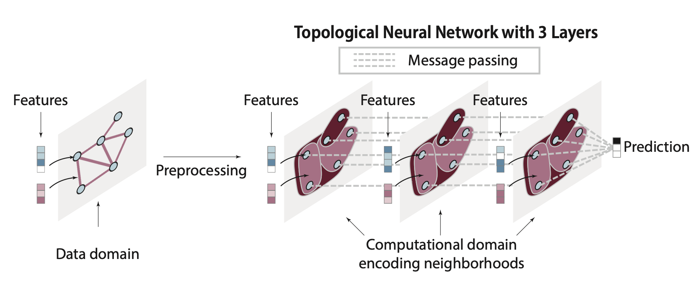
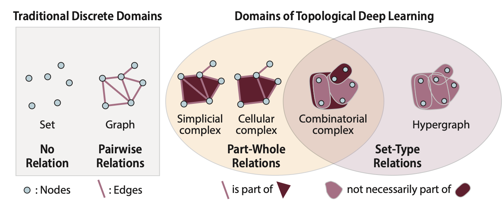
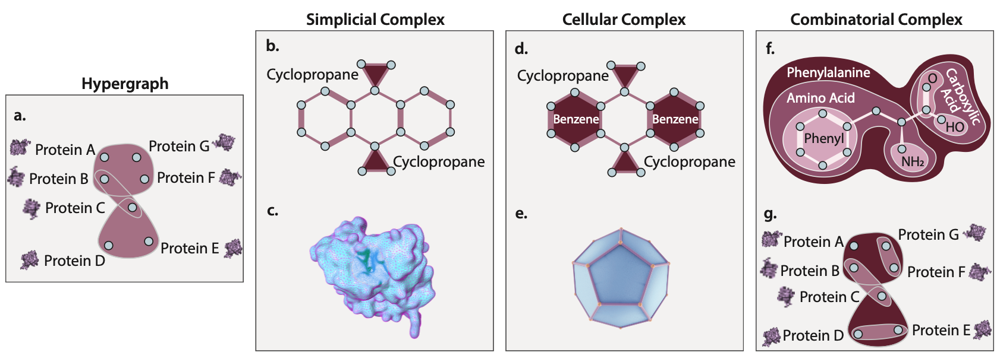
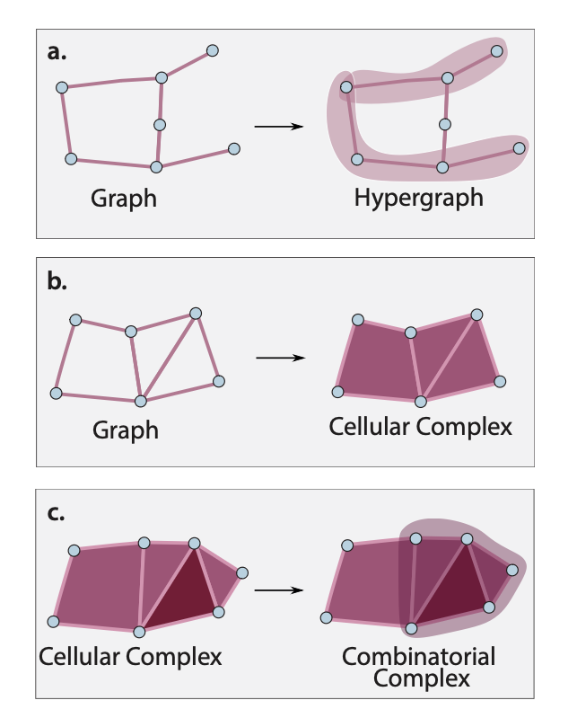
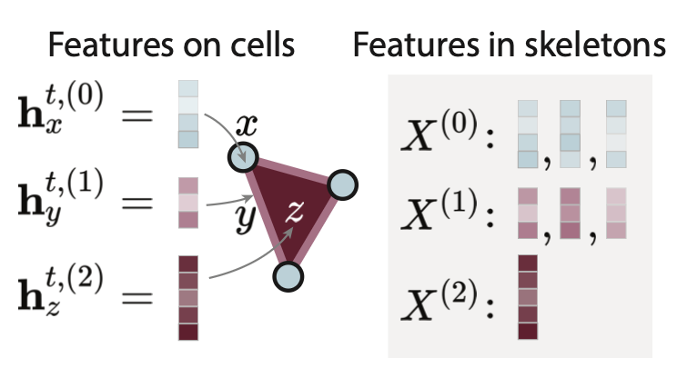
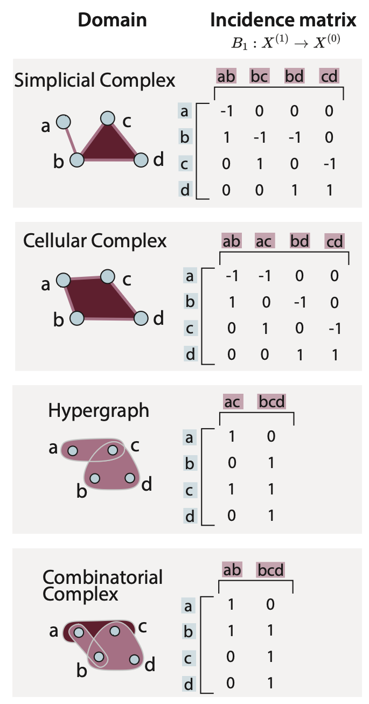
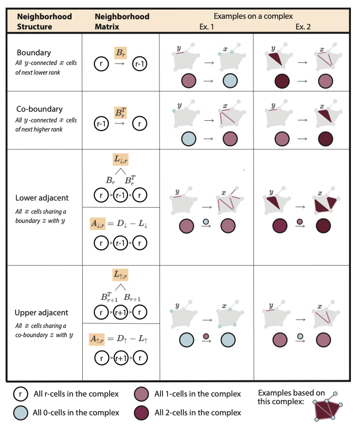
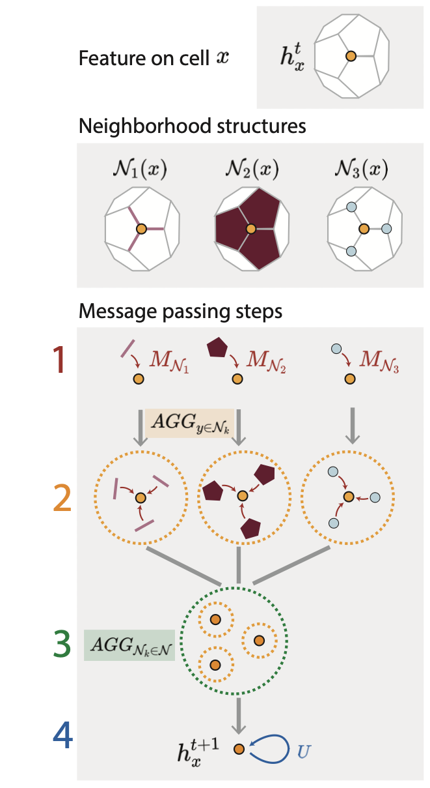

@papillon2023architectures 을 리뷰해보자. 

**ABSTRACT**

자연 세계는 복잡한 시스템들로 가득 차 있으며, 이들은 구성 요소들 간의 정교한 관계로 특징 지어진다. 예를 들어, 소셜 네트워크에서 개인 간 사회적 상호작용이나, 단백질 내 원자 간의 정전기적 상호작용이 그러하다. Topological Deep Learning(TDL)은 이러한 시스템과 관련된 데이터를 처리하고 지식을 추출하기 위한 종합적인 프레임워크를 제공한다. 예를 들어, 개인이 속한 사회적 커뮤니티를 예측하거나, 어떤 단백질이 약물 개발의 적절한 표적인지를 예측할 수 있다. TDL은 이론적, 실용적 측면에서 모두 강력한 장점을 보여주고 있으며, 응용과학 등 다양한 분야에서 돌파구를 열 수 있는 잠재력을 지니고 있다. 하지만, 관계 기반 시스템을 위한 TDL 관련 문헌이 급속히 증가하면서, 메시지 패싱 방식의 Topological Neural Networks(TNN) 사이에서 표기법과 용어의 통일성이 부족한 상황이 벌어졌다. 이는 기존 연구들을 기반으로 새로운 연구를 쌓아가기 어렵게 만들며, TNN을 현실 문제에 적용하는 데도 큰 장애물이 된다. 이 문제를 해결하기 위해, 본 논문에서는 관계 기반 시스템을 위한 TDL을 쉽고 명확하게 소개하고, 최근 발표된 메시지 패싱 기반 TNN들을 수학적/시각적으로 통일된 표기법으로 비교한다. 이처럼 직관적이면서도 비판적인 시각에서 TDL이라는 신흥 분야를 검토함으로써, 현재의 도전 과제와 앞으로의 흥미로운 연구 기회에 대한 중요한 통찰을 제공한다.

- TNN 이라는것도 있나봄

**INTRODUCTION**

사회적 네트워크 [1]와 단백질 [2]처럼 다양한 자연 시스템들은 관계적 구조(relational structure)를 특징으로 한다. 이러한 구조는 시스템 내 구성 요소들 간의 상호작용을 의미한다. 예를 들어 개인 간의 사회적 상호작용이나, 원자 간의 정전기적 상호작용 등을 의미한다. Geometric Deep Learning [3] 분야에서는, 그래프 신경망(GNN) [4]이 그래프를 활용하여 관계형 데이터를 처리하는 데에 뛰어난 성과를 보여주었다. 그래프는 보통 두 요소 간의 관계를 표현하는 데 널리 사용되는 수학적 도구이다. 하지만, 그래프의 쌍(pairwise) 관계 구조에는 한계가 있다. 예를 들어, 사회적 상호작용은 두 사람 이상이 동시에 참여할 수 있고, 정전기적 상호작용 또한 두 개 이상의 원자 사이에 발생할 수 있다. 이러한 한계를 극복하기 위해 등장한 것이 Topological Deep Learning(TDL) [5], [6]이다. TDL은 더 일반적인 수학적 추상화를 통해 고차원의 관계 구조(higher-order relational structure)를 가진 데이터를 처리합니다. TDL의 모델들인 Topological Neural Networks(TNN)는 이론적으로 보장된 수학적 특성 [7]–[9]을 갖고 있으며, 다양한 기계학습 과제 [10]–[13]에서 최첨단 성능(state-of-the-art performance)을 달성하고 있다. 또한, 이 모델들은 응용 과학 및 그 너머의 분야에서도 높은 잠재력을 보여준다. 하지만, TDL 문헌 전반에 걸친 추상적인 개념과 수학적 표기법의 단편화는 이 분야의 접근성을 크게 떨어뜨리고, 모델 간 비교를 어렵게 하며, 새로운 혁신의 기회를 가리는 결과를 초래하고 있다. 이러한 문제를 해결하기 위해, 본 논문에서는 지금까지 발표된 메시지 패싱 기반 TNN 아키텍처들(이하 TNNs)을 직관적이고 체계적으로 비교하겠다. 논문의 기여점은 아래와 같다. 

- 현실 문제에 TNN을 적용하고자 하는 입문자들도 쉽게 접근할 수 있는 교육용 자료.
- TNN의 구조, 구현 방식, 실제 응용 사례에 대한 포괄적이고 비판적인 리뷰 (해당 논문에서 사용하는 표기법으로 다시 작성된 수식과 함께 제공되며, 이는 다음 주소에서 확인 가능함: <https://github.com/awesome-tnns>)
- 미해결 연구 질문들, 주요 도전 과제들, 그리고 혁신을 위한 기회의 요약.

이 분야에서 공통되고 접근하기 쉬운 언어를 정립함으로써, 우리는 입문자와 숙련된 연구자 모두가 TDL 분야의 첨단 연구를 위한 탄탄한 기반을 다질 수 있도록 돕고자 한다. 기존 문헌 리뷰들 중에는 위상수학과 머신러닝의 교차점에서 데이터 표현 [14]이나 물리학 기반 모델들 [15]에 중점을 둔 것들이 있다.
메시지 패싱 기반 TNN들은 위상 정보를 활용하는 더 넓은 범주의 머신러닝 아키텍처에 속한다. 이 범주는 [16]에서 처음으로 정리되었으며, 예를 들어 Topological Data Analysis(TDA)와 같이 머신러닝을 위한 다양한 기법들을 포함한다. 이 경우, persistent homology(지속 호몰로지)와 같은 기법으로부터 계산된 특징(feature)들이 데이터 표현 개선이나 모형 선택 향상에 활용될 수 있다.

- [5]^[M. Hajij, G. Zamzmi, T. Papamarkou, N. Miolane, A. Guzm´an, S´ aenz, K. N. Ramamurthy, T. Birdal, T. Dey, S. Mukherjee, S. Samaga, N. Livesay, R. Walters, P. Rosen, and M. Schaub, “Topological deep learning: Going beyond graph data,” arXiv preprint arXiv:1906.09068 (v3), 2023.], [6]^[C. Bodnar, “Topological deep learning: Graphs, complexes, sheaves,” Ph.D. dissertation, Apollo - University of Cambridge Repository, 2022.]에 대한내용을 읽어봐야겟는데?
- [5]는 여러저자가 참여함
- [7]-[9]에 있다고 언급한 이론적으로 보장된 수학적 특성이 뭐지..??
- [16]^[F. Hensel, M. Moor, and B. Rieck, “A survey of topological machine learning methods,” Frontiers in Artificial Intelligence, vol. 4, 2021.] 도 읽을만한것 같은데 프론티어네??

**TOPOLOGICAL NEURAL NETWORKS**

Topological Neural Networks (TNNs)는 단백질 구조, 도시 교통 지도, 인용 네트워크와 같이 위상적으로 복잡한 시스템과 연관된 데이터로부터 지식을 추출하는 딥러닝 아키텍처이다. TNN은 Graph Neural Network(GNN)처럼, 여러 층을 쌓은 구조로 이루어져 있으며, 각 층은 데이터를 일련의 특징(feature)으로 변환한다 (그림 1 참고). 각 층에서는 데이터와 계산 도메인, 이웃(neighborhood), 그리고 메시지 패싱(message passing)이라는 핵심 개념을 활용하는데, 이 섹션에서는 이들 개념을 설명한다.

- 그림 1: 토폴로지 신경망(Topological Neural Network): 복잡한 시스템과 연관된 데이터는 데이터 도메인(data domain) 위에 정의된 특징(feature)으로 표현된다. 이 데이터는 시스템 구성 요소들 간의 상호작용을 이웃(neighborhood) 관계로 인코딩하는 계산 도메인(computational domain)으로 전처리된다. TNN의 각 층은 메시지 패싱(message passing)을 사용하여 특징을 반복적으로 업데이트하며, 최종적으로 분류 결과 등과 같은 출력을 생성한다. 

**A. Domains**

Topological Deep Learning(TDL)에서는 데이터가 이산적인 도메인(discrete domain) 위에 정의된 특징(feature)으로 표현됩니다 [5], [6]. 전통적인 이산 도메인의 예로는 집합(set)과 그래프(graph)가 있으며, 이는 그림 2의 왼쪽에 나타나 있다.

- 집합(set)은 구조가 없는 노드(node)들의 모음으로, 별다른 관계가 정의되지 않는다.
- 그래프(graph)는 노드 간의 쌍(pairwise) 관계를 나타내는 간선(edge)이 포함된 구조이다. 이 간선은 기하학적인 근접성 또는 보다 추상적인 관계를 표현한다.

예를 들어, 그래프는 단백질을 표현할 수 있으며, 이 경우 노드는 원자(atom)를, 간선은 그 사이의 결합(bond)을 나타낸다. 또 그래프는 소셜 네트워크를 나타낼 수도 있으며, 이때 노드는 개인을, 간선은 사회적 관계를 의미한다. TDL에서 사용하는 도메인은 이러한 그래프의 쌍관계(pairwise relation)를 일반화하여, 부분-전체(part-whole) 관계나 집합형(set-type) 관계 같은 보다 복잡한 관계 구조를 표현할 수 있다 (그림 2의 오른쪽 참고) [5].
이 문단에서는 각 도메인의 주요 특성을 설명하고, 어떤 데이터 유형에 적합한지를 강조한다. 더 깊이 있는 논의는 문헌 [14], [5]를 참고하길 권장한다.

- 그림 2. 도메인들: 파란색은 노드(node), 분홍색은 (하이퍼)간선((hyper)edge), 진한 빨간색은 **면(face)**을 나타낸다. 이 그림은 [11]번 문헌에서 수정·재구성된 것임.

:::{.callout-note}
**그래프 그 너머: 토폴로지 딥러닝의 도메인들**

**집합 + 쌍(pairwise) 관계**

- 그래프 (Graph): 노드(node)들의 집합이 쌍 관계를 나타내는 간선(edge)들로 연결된 구조임. 

**집합 + 부분-전체(part-whole) 관계**

- 심플리셜 콤플렉스 (Simplicial Complex, SC): 그래프의 일반화된 형태로, 세 개의 간선이 삼각형 면(triangular face)을 이루고, 네 개의 삼각형이 사면체 부피(tetrahedral volume)를 이루는 등 더 높은 차원의 구조를 형성할 수 있음. 단, 간선은 여전히 노드 쌍만을 연결함.
- 셀룰러 콤플렉스 (Cellular Complex, CC): SC의 확장된 형태로, 면(face), 부피(volume) 등이 삼각형이나 사면체에 제한되지 않고 임의의 모양을 가질 수 있음. 하지만 간선은 여전히 노드 쌍만을 연결함.

**집합 + 집합형(set-type) 관계**

- 하이퍼그래프 (Hypergraph, HG): 그래프의 일반화된 형태로, 하이퍼간선(hyperedge)이라는 고차 간선을 통해 두 개 이상의 노드로 이루어진 임의의 집합을 연결할 수 있음.

**집합 + 부분-전체 + 집합형 관계**

- 콤비네토리얼 콤플렉스 (Combinatorial Complex, CCC): HG와 CC의 특징을 결합한 구조임. HG처럼 간선이 임의의 수의 노드를 연결할 수 있고, CC처럼 셀들을 조합하여 더 높은 계층의 구조를 만들 수 있음.
:::

*Simplicial complexes (SCs)*

그래프를 일반화한 심플리셜 콤플렉스(SC)는 계층적인 부분-전체 관계를 다중 스케일로 구성된 셀(cell)을 통해 표현한다. 노드(node)는 0차 셀(rank 0 cell)로 간주되며, 이 노드들이 결합되어 간선(edge, 1차 셀)을 형성하고, 간선들이 결합되어 면(face, 2차 셀)을 면들이 결합되어 부피(volume, 3차 셀)를 형성하며, 이와 같은 방식으로 더 높은 차원으로 확장된다. 따라서 SC에서는 면은 반드시 삼각형이고, 부피는 반드시 사면체여야 하며, 그 이상도 마찬가지로 정해진 형태를 따라야 한다. SC는 일반적으로 삼각형 메쉬(triangular mesh)로 표현된 3차원 기하학적 표면의 이산 표현(discrete representation)을 인코딩하는 데 널리 사용된다 (그림 3 참고).

- 그림3: 위상 도메인(topological domains) 위 데이터의 예시들 (a) 단백질 네트워크에서의 고차 상호작용 (b) 제한적인 분자 표현: 고리가 세 개의 원자만 포함 가능 (c) 단백질 표면의 삼각형 메쉬(triangular mesh) (d) 더 유연한 분자 표현: 임의의 고리 모양 작용기(ring-shaped functional group)도 표현 가능 (e) 임의의 모양의 면(face)을 포함할 수 있는 유연한 메쉬 (f) 완전히 유연한 분자 표현: 분자 및 기타 자연계 시스템에서 나타나는 복잡하고 중첩된 계층적 구조도 표현 가능 (g) 단백질 네트워크에서의 계층적인 고차 상호작용

*Cellular complexes (CCs)*

셀룰러 콤플렉스(Cellular Complex, CC)는 심플리셜 콤플렉스(SC)를 일반화한 구조로, 각 셀이 단순 단체(simplex)에 제한되지 않는다. 즉, 면(face)은 세 개 이상의 노드를 포함할 수 있고, 부피(volume)는 네 개 이상의 면으로 구성될 수 있으며, 이와 같은 방식으로 계속 확장된다. 이러한 유연성 덕분에, CC는 SC보다 더 높은 표현력을 가진다 [8]. 따라서 연구자가 세 개 이상의 노드 간의 부분-전체(part-whole) 관계가 중요한 시스템을 연구할 때는 이 도메인(CC)을 사용하는 것이 적절할 수 있다. 이러한 시스템의 예시로는 벤젠 고리(benzene ring)를 가진 분자가 있다. (그림 3 참고).

*Hypergraphs (HGs)*

하이퍼그래프(Hypergraph, HG)는 그래프(graph)를 확장한 개념으로, 하이퍼간선(hyperedge)이라 불리는 간선이 두 개 이상의 노드를 동시에 연결할 수 있다. HG에서의 연결은 집합형(set-type) 관계를 나타내며, 이는 어떤 상호작용에의 참여가 시스템 내 다른 관계로부터 자동으로 추론되지 않는 경우를 의미한다.^[예를들어 단백질 A, B, C 간의 상호작용이 있다 하더라도, 이것이 곧 A와 B가 단독으로도 상호작용한다는 것을 의미하지 않음. 이거 살짝 교호작용 느낌인데?] 이러한 특성 덕분에 HG는 의미론적 텍스트(semantic text)나 인용 네트워크(citation network)처럼
복잡하고, 크기가 임의적이며, 모든 구성 요소가 동등하게 중요한 추상적 관계를 가진 데이터에 적합하다. 단백질 상호작용 네트워크(그림 3 참조) 또한 이러한 특성을 보인다: 특정 단백질 간의 상호작용은 딱 그 구성만 필요한 경우가 많으며, 하나라도 빠지거나 더 추가되면 상호작용이 성립되지 않는다. 예를 들어, 단백질 A, B, C 간의 상호작용이 있다 하더라도, 이것이 곧 A와 B가 단독으로도 상호작용한다는 것을 의미하지는 않는다.

*Combinatorial complexes (CCCs)*

콤비네토리얼 콤플렉스(Combinatorial Complex)는 셀룰러 콤플렉스(CC)와 하이퍼그래프(HG)를 일반화한 구조로, 부분-전체(part-whole) 관계와 집합형(set-type) 관계를 모두 포괄할 수 있다 [5], [11]. 이 구조의 장점은 분자 표현(molecular representation)의 예를 통해 확인할 수 있다. 심플리셜 콤플렉스(SC)나 셀룰러 콤플렉스(CC)는 엄격한 기하학적 제약이 있기 때문에, 분자 내에서 관찰되는 복잡한 계층적 구조를 표현하기에는 너무 제한적이다. 반면, 콤비네토리얼 콤플렉스는 유연하면서도 계층적으로 순위가 매겨진 하이퍼간선(hyperedge)를 사용하여 분자의 구조적 복잡성과 풍부함을 완전하게 표현할 수 있다 (그림 3 참고). 이 구조는 2022년 [11]에서 처음 소개되었고, 이후 [5]에서 이론적으로 더욱 정립되었다. 현재까지 제안된 가장 최근이자 가장 일반적인 위상 도메인이다.

*1) Terminology* 

이산적인 도메인 전반에서, 우리는 셀(cell)이라는 용어를 노드 그자체 또는 노드들 간의 관계, 예를 들어 (하이퍼)간선, 면, 부피 등을 통칭하는 데 사용한다. 셀은 두 가지 속성을 가지는데, 하나는 크기(size)로, 이는 해당 셀이 포함하고 있는 셀의 개수를 의미하고, 다른 하나는 순위(rank)로, 여기서 노드는 보통 rank 0, 간선과 하이퍼간선은 rank 1, 면은 rank 2 등으로 정의된다. 심플리셜 콤플렉스와 셀룰러 콤플렉스의 경우, 이러한 셀 구조는 부분-전체 관계를 반영하며, 이는 셀의 순위와 크기 사이의 일정한 관계를 강제한다. 즉, rank가 r인 셀은 정확히 (혹은 적어도) r−1 순위를 가진 r+1개의 셀을 포함해야 한다. 예를 들어, rank 2인 면(face)은 정확히 (혹은 적어도) 3개의 간선(rank 1)을 포함한다. 반면, 하이퍼그래프의 셀은 부분-전체 관계를 인코딩하지 않으며, 하이퍼간선은 크기에 제한 없이 얼마든지 많은 노드를 가질 수 있다. 그러나 하이퍼그래프에서는 셀의 순위가 0과 1까지만 허용된다. 한편, 콤비네토리얼 콤플렉스(combinatorial complex)는 순위와 크기 모두에 대해 제약이 없는 구조이며, 노드는 rank 0을 갖고, 크기가 1보다 큰 셀들은 어떤 순위든 가질 수 있다.

- 그림4: 위상 도메인의 리프팅(Lifting Topological Domains) (a) 그래프는 하이퍼간선(hyperedge)을 추가하여, 여러 노드들을 하나로 연결함으로써 하이퍼그래프(hypergraph)로 리프팅될 수 있다. (b) 그래프는 임의의 모양을 가진 면(face)을 추가함으로써 셀룰러 콤플렉스(cellular complex)로 리프팅될 수 있다. (c) 셀룰러 콤플렉스에 하이퍼간선을 추가하면, 그 구조는 콤비네토리얼 콤플렉스(combinatorial complex)로 리프팅된다. 이 그림은 [5]에서 인용한 것이다.

데이터가 본래 정의되어 있는 도메인(데이터 도메인)과, TNN(Topological Neural Network) 내에서 데이터가 실제로 처리되는 도메인(계산 도메인) 사이에는 중요한 차이가 있다. 예를 들어, 그래프에 정의된 데이터는 전처리 과정(Figure 1)을 거쳐 다른 도메인으로 "들어올려질(lifted)" 수 있으며(Figure 4), 이를 통해 보다 풍부한 정보 구조를 가진 계산 도메인(computational domain)에서 처리될 수 있다. 예를 들어, 단백질이 처음에는 원자(노드)와 공유 결합(간선)으로 구성된 그래프로 주어진다고 하자. 이러한 구조는 전처리를 통해 고리(ring, face) 구조를 명시적으로 표현하는 셀룰러 콤플렉스(CC) 계산 도메인으로 들어올려질 수 있다. 이 리뷰 논문에서는, "도메인"이라는 용어가 기본적으로 계산 도메인(computational domain)을 가리킨다. 또한, 계산 도메인은 TNN의 층(layer)에 따라 동적으로 변할 수 있다.^[층 마다 다른 계산도메인을 이용할 수 있다는 의미]

:::{.callout-note}
**동적 도메인(Dynamic Domains)**

정적(static) vs. 동적(dynamic): TNN(Topological Neural Network)에서 정적 도메인이란, 모든 레이어에서 동일한 도메인을 사용하는 경우를 의미한다. 예를 들어, Figure 1에서는 세 개의 레이어가 모두 동일한 CCC(combinatorial complex) 위에서 작동하며, 레이어가 달라지더라도 변화하는 것은 피처(feature)뿐이다. 반면, 동적 도메인(dynamic domain)은 레이어마다 도메인이 바뀌는 경우이다. 이 경우에는 노드가 추가되거나 제거될 수 있고, 엣지가 새로 연결되거나 재구성(rewired)될 수도 있다. 
:::

*2) Limitations:*

심플리셜 콤플렉스(SC)와 셀룰러 콤플렉스(CC) 모두의 중요한 한계 중 하나는, face(면)나 그에 상응하는 고차 구조(higher-order structure)들이 오직 고리(ring) 형태로만 구성될 수 있다는 점이다. 즉, face의 경계에 있는 노드들은 반드시 쌍(pairwise)으로 연결되어 있어야 한다. 하지만 많은 경우, 이러한 제약은 너무 엄격하게 작용하며, 도메인 내에 인위적인 연결(artificial connection)을 만들어내는 원인이 될 수 있다 [17]. 예를 들어, 인용 네트워크(citation network)를 SC로 리프팅할 경우, 논문 하나를 함께 쓴 세 명의 저자 집합 (A, B, C)에 대해서는 세 사람 모두가 서로 쌍으로 연결되어 있어야만 SC에서의 face로 표현할 수 있습니다. 즉, A와 B, A와 C, B와 C 사이에 각각 간선이 존재해야 한다. 하지만 실제로는 A와 B, 혹은 A와 C가 단독으로 논문을 쓴 적이 없을 수도 있다.^[그러니까 SC는 face가 존재하는데, edge가 존재하지 않을 수 없음. 그게 너무 큰 제약으로 다가온다] 이를 해결하기 위해 [17]에서는 보다 느슨한(relaxed) 정의의 SC를 제안했고, 이러한 수정된 도메인에서 TNN을 학습시키면 성능이 향상됨을 보여주었다. 한편, 인위적인 연결이 존재하더라도 SC와 CC는 여전히 TNN이 더 풍부한 위상 구조를 활용하게 해주며, GNN이 직면하는 계산적 문제들을 피할 수 있게 해준다 [18]. 또한, 어떤 위상 도메인이든지 수학적으로는 (더 큰 형태일 수 있는) 그래프로 등가 변환될 수 있다는 점도 주목할만하다 [19].^[노드를 많이 만들면 되지 않을까? 그래서 GSP는 여전히 살아있는 영역이겠구나..] 이 논문에서는 초심자들에게 직관적으로 설명하고, 또한 문헌에서 널리 채택되고 있는 표현 방식을 반영하기 위해 위에서 언급한 위상 도메인들의 형태를 그대로 사용한다.

:::{.callout-important}

"GNN이 직면하는 계산적 문제들을 피할 수 있게 해줌 [18] ???"

| 문제                 | GNN에서의 한계                              | SC/CC가 제공하는 해결책                            |
|----------------------|----------------------------------------------|---------------------------------------------------|
| Oversmoothing        | 노드 표현이 점점 똑같아짐                    | 고차 셀을 통한 다중 경로 제공 → 표현 다양성 유지     |
| Over-squashing       | 정보가 좁은 경로에 압축되어 손실 발생         | 셀 단위 메시지 패싱 → 정보 흐름 확장 가능            |
| 표현력 한계          | 쌍관계(pairwise)만 모델링 가능                | 삼자 이상 고차 관계를 자연스럽게 표현 가능           |

:::

*3) Features on a Domain:*

${\cal X}$라고 표기되는 도메인은, 어떤 시스템의 구성 요소들 간의 관계를 인코딩하는 구조로 생각할 수 있다. 이 도메인 위의 데이터는 각 셀(cell)에 정의된 특징(feature)으로 표현된다. 일반적으로 이러한 특징은 $\mathbb{R}^d$ 공간의 벡터로, 각 셀의 속성(attribute)을 담고 있다. 예를 들어, 분자 내에서 특징은 원자(노드), 결합(간선), 작용기(면)의 종류를 나타낼 수 있습니다. 또는, 여러 약물들 간의 상호작용(하이퍼간선)에 관련된 특징은 부작용 발생 확률 같은 정보를 담을 수 있다. 우리는 TNN의 $t$번째 레이어에서, 셀 $x \in {\cal X}$ (순위 $r$) 위에 정의된 특징을 다음과 같이 표기한다:^[특징은 ${\bf h}$ 로 표현하는듯 하고 ${\bf h}$는 $d$차원 벡터임. hst에서는 쌓인 눈의 수만큼 $d$를 늘릴수 있지 않을까?]

$${\bf h}^{t,(r)}_{x}, \quad\text{where } r \text{ is rank of } x$$

도메인 ${\cal X}$는 각 $r$에 따라 분해할 수 있는데, 순위 $r$에 해당하는 모든 셀들의 집합을 ${\cal X}^{(r)}$ 또는 $r$-스켈레톤(r-skeleton)이라고 부른다. 특징은 범주형(categorical)일 수도 있고, 수치형(quantitative)일 수도 있다. 그리고 스켈레톤 간에 특징 차원(feature dimension)이 서로 다를 수도 있는데 이러한 경우 해당 도메인을 이질적(heterogeneous)이라고 부른다.^[그러니까 노드들의 집합은 속성이 4개씩 있고, 간선들의 집합은 속성이 3개씩 있다는 식..? 그런데 생각해보니까 이런식이면 어지간하면 모든 도메인은 이질적이겠는데?]

- 그림 5. 도메인 위의 특징(Features on a Domain) 왼쪽: 세 개의 셀 — $x$, $y$, $z$ —에 부여된 특징들. 오른쪽: 전체 복합체(complex)의 스켈레톤 구조. ${\cal X}^{(0)}$는 노드 특징, ${\cal X}^{(1)}$는 엣지(간선) 특징, 그 이후는 계속해서 고차 셀의 특징을 포함한다.

각 셀에 할당되는 특징(feature)은 데이터로부터 직접 주어질 수도 있고, 사용자(연구자)가 수작업으로 설계할 수도 있다. 또는, 전처리 단계에서 임베딩(embedding) 기법을 사용하여 특징을 할당할 수도 있다. 이러한 임베딩 방법은 공간의 지역 구조(local structure)를 인코딩한 셀 특징 벡터(cell feature vector)를 계산해 준다. 그래프의 경우, 대표적인 임베딩 기법으로는 DeepWalk [20]와 Node2Vec [21]이 있으며, 이들은 노드를 임베딩하는 데 널리 사용된다. 최근 연구에서는 이러한 임베딩 기법들을 위상 도메인(topological domains)에 맞게 일반화하였다: 하이퍼그래프(hypergraph)에는 Hyperedge2Vec [22], Deep Hyperedge [23], 심플리셜 콤플렉스(simplicial complex)에는 Simplex2Vec [24], k-Simplex2Vec [25], 셀룰러 콤플렉스(cellular complex)에는 Cell2Vec [26] 같은 기법들이 사용된다.

**B. Neighborhood Structure**

TNN(Topological Neural Network)은 각 레이어를 거치며 셀의 특징(feature)을 반복적으로 업데이트하는데, 이때 셀들 간의 "가까움(nearness)" 개념, 즉 이웃 구조(neighborhood structure)를 사용한다. (Figure 1 참고). 이웃 구조는 경계 관계(boundary relation)에 의해 정의된다. 경계 관계는 서로 다른 순위(rank)를 가진 셀들 사이의 포함 관계를 설명한다. 즉, rank $r$인 셀 $y$가 rank $R$인 셀 $x$와 연결되어 있고 $r < R$일 때, $y$는 $x$의 경계(boundary)에 있다고 말하며, 이 관계는 수학적으로 $y \prec x$로 표현됩니다.^[즉 경계란 셀과 셀이 연결되어있는데 (혹은 포함되어있는데) rank가 다른 경우를 의미함] 예를 들어, 어떤 엣지(edge)에 연결된 노드(node)는 그 엣지의 경계에 있다고 할 수 있다. 이러한 경계 관계는 인시던스 행렬(incidence matrix)에 의해 인코딩된다. 구체적으로, $B_r$는 rank $r-1$인 셀들이 rank $r$인 셀들의 경계로 존재하는지를 기록하는 행렬이다. (Figure 6 참고).

- 그림 6. 인시던스 행렬(Incidence Matrices) SC(심플리셜 콤플렉스), CC(셀룰러 콤플렉스), HG(하이퍼그래프), CCC(콤비네토리얼 콤플렉스)의 예시와 각 도메인에 대응되는 경계 행렬 $B_1$이 함께 제시되어 있다. 이 행렬들은 1-셀(엣지)에서 0-셀(노드)로의 경계를 나타낸다. SC와 CC의 경계 행렬에서 엣지 방향성(edge orientation)은 부호(signed)로 표현된다. 임의로 정해진 노드 순서 $(a, b, c, d)$에서 먼저 나오는 노드는 항상 –1로 할당된다.

형식적으로 $B_r$은 크기가 $n_{r-1} \times n_r$인 행렬이다. 여기서 $n_r$은 rank $r$ 이상의 셀 개수를 나타낸다.^[그러니까 그림에서는 ${\cal X}^{(1)} \to {\cal X}^{(0)}$만 있는데.. 실제로는 ${\cal X}^{(2)} \to {\cal X}^{(0)}$와 같은 형태도 가능하다는 것이지]

$$(B_r)_{i,j} = 
\begin{cases}
\pm 1 & \text{if } x_i^{(r-1)} \prec x_j^{(r)} \\
0     & \text{otherwise},
\end{cases}
\tag{1}$$

여기서 $x_i^{(r-1)}$, $x_j^{(r)}$는 각각 rank $r-1$과 rank $r$를 가지는 두 개의 셀을 의미한다. 기호 $\pm 1$은 SC(심플리셜 콤플렉스)와 CC(셀룰러 콤플렉스)에서 요구되는 방향성(orientation) 개념을 인코딩한다 [27], [28]. HG(하이퍼그래프)와 CCC(콤비네토리얼 콤플렉스)에서는 항상 +1로 설정된다. 인시던스 행렬(incidence matrix)은 문헌에서 가장 일반적으로 사용되는 네 가지 이웃 구조(neighborhood structure)를 표현하는 데 사용될 수 있다. 이러한 구조들은 그림 7(Fig. 7)에 제시되어 있다. 

- 그림 7. 이웃 구조(Neighborhood Structures): 각 이웃 구조에 해당하는 이웃 행렬(neighborhood matrix)과,셀 $y$의 이웃에 있는 셀 $x$를 예로 든 시각적 설명(illustration)이 함께 제시되어 있다.

아래는 4가지 이웃구조에 대한 정의이다. 

:::{.callout-note}

**이웃 구조 (Neighborhood Structures)**

***1. 경계 이웃 (Boundary Adjacent Neighborhood)***

- $\mathcal{B}(y) = \{x \mid x \prec y\}$
- $y$ 보다 한 단계 낮은 순위를 가지며, 경계 관계를 통해 연결된 셀 $x$ 들의 집합.
- 이 이웃 구조는 경계 행렬 $B_r$ 정의된다. 
- (예시) -- 엣지 $y$ 에 연결된 노드 $x$들의 집합.

***2 공경계 이웃 (Co-Boundary Adjacent Neighborhood)***

- $\mathcal{C}(y) = \{x \mid y \prec x\}$
- $y$보다 한 단계 높은 순위를 가지며, $y$를 경계로 포함하는 셀 $x$들의 집합.
- 이 이웃 구조는 공경계 행렬 $B_r^\top$으로 정의된다. 
- (예시) -- 노드 $y$에 연결된 엣지 $x$들의 집합.

***3 하위 인접 이웃 (Lower Adjacent Neighborhood)***

- $\mathcal{L}_\downarrow(y) = \{x \mid \exists z \text{ such that } z \prec y \text{ and } z \prec x\}$
- 셀 $x$와 셀 $y$가 공통된 경계 $z$를 공유하는 경우의 $x$들의 집합. 
- 이 이웃 구조는 다음 중 하나로 정의된다.
    1. $L^\downarrow_r = B_r B_r^\top \quad \text{(하위 라플라시안)}$
    2. $A^\downarrow_{1, r} = D_r - L^\downarrow_r \quad \text{(하위 인접 행렬)}$
- (예시) -- 엣지 $y$에 연결된 노드 $z$들과 함께 연결되어 있는 다른 엣지 $x$들의 집합.

> 여기에서 $D_r \in \mathbb{N}^{n_r \times n_r}$는 차수 행렬(degree matrix)을 의미하며, 이는 rank $r$인 셀이 rank $r+1$인 셀과 얼마나 연결되어 있는지를 나타내는 대각 행렬이다. 

***4 상위 인접 이웃 (Upper Adjacent Neighborhood)***

- $\mathcal{L}^\uparrow(y) = \{x \mid \exists z \text{ such that } y \prec z \text{ and } x \prec z\}$
- 셀 $x$와 셀 $y$가 공통된 상위 셀 $z$에 포함되어 있는 경우의 $x$들의 집합임.
- 이 이웃 구조는 다음 중 하나로 정의된다. 
    1. $L^\uparrow_r = B_{r+1}^\top B_{r+1} \quad \text{(상위 라플라시안)}$
    2. $A^\uparrow_r = D_r - L^\uparrow_r \quad \text{(상위 인접 행렬)}$
- (예시): 노드 $y$에 연결된 엣지 $z$들과 함께 연결되어 있는 다른 노드 $x$들의 집합.
:::

여기서 $L^{\downarrow}_0$는 전형적인 그래프 라플라시안(graph Laplacian)을 의미한다. 그리고 그래프 라플라시안의 고차 일반화(higher-order generalization)인 $r$-Hodge 라플라시안은 아래와 같이 정의됩니다: ([12], [29] 참고) 

$$H_r = L^{\downarrow}_r + L^{\uparrow}_r$$ 

**C. Message Passing**

메시지 패싱(message passing)은 TNN(Topological Neural Network)의 단일 레이어 $t$에서 수행되는 계산 과정을 정의한다. 메시지 패싱 과정에서는, 각 셀의 특징 ${\bf h}_{x}^{t, (r)}$을 다음을 반영하여 업데이트한다. 

1. 해당 셀의 이웃에 위치한 다른 셀들의 특징
2. 해당 레이어의 학습 가능한 파라미터 $\Theta_t$.^[그러니까 이 $\Theta$를 이용해서 다른셀들의 특징을 얼만큼 반영하여 update할지 결정하는 것이지?] 

"메시지 패싱"이라는 용어는, 신호가 네트워크를 따라 "이동"하면서, 이웃 구조에 의해 정해진 경로를 따라 셀들 사이로 "전달된다"는 개념을 반영한다. 레이어 $t$의 출력 ${\bf h}^{t+1}$은 다음 레이어 $t+1$의 입력으로 사용된다. 이러한 과정을 반복하면서, 더 깊은 레이어는 더 먼 셀로부터의 정보를 점진적으로 통합하게 되고, 결과적으로 정보가 네트워크를 통해 확산(diffusion)되어 나가는 효과를 가지게 된다.

*1) The Steps of Message Passing:* 우리는 메시지 패싱(message passing) 과정을 네 단계로 분해하며,
이 구조는 [5]의 프레임워크를 참고하여 채택한 것이다. 각 단계는 서로 다른 색상—빨강, 주황, 초록, 파랑—으로 표시되며,
그림 8(Figure 8)에 시각적으로 설명되어 있다.

- 그림 8: 메시지 패싱 단계 -- 1단계: 메시지(Message, 빨강), 2단계: 이웃 내 집계(Within-neighborhood aggregation, 주황), 3단계: 이웃 간 집계(Between-neighborhood aggregation, 초록), 4단계: 업데이트(Update, 파랑)로 구성된다. 이 스킴은, 레이어 $t$에서 (왼쪽열) $r$-셀 $x$에 정의된 특징 ${\bf h}_{x}^{t,(r)}$을, 다음 레이어 $t+1$ 에서 같은 셀 $x$ 위의 새로운 특징 ${\bf h}_{x}^{t+1,(r)}$으로 (오른쪽열) 업데이트하는 과정을 설명한다. 이 스킴에서는, 네 개의 이웃 구조 $\mathcal{N}_k$ (중간 열)을 사용하며, $k \in \{1, 2, 3, 4\}$이다. 이 그림은 [5]에서 인용하여 수정된 것임.
