## 기본익히기

### `i`, `esc`, `w`, `q` -- 편집, 명령, 저장, 종료

>  예제: vi를 이용하여 파일 만들고 asdf 입력 후 저장 및 종료를 수행하여 보자.

::: {.panel-tabset}
### step1

`-` 파일생성 

```bash
vim test230803.txt 
```

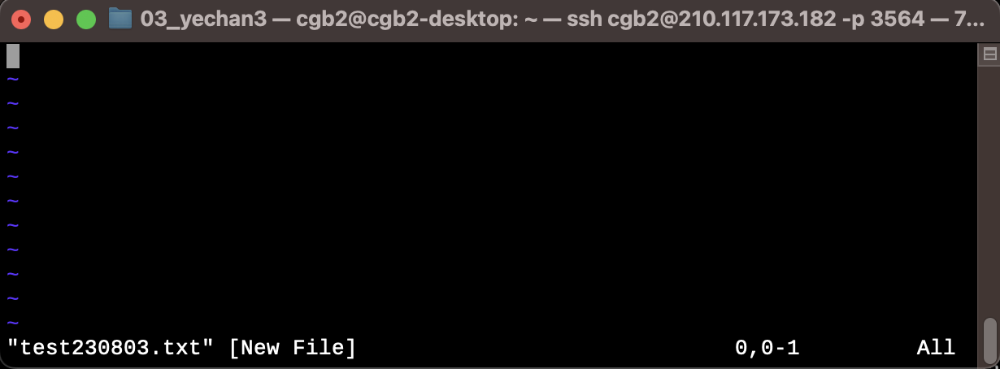

### step2

`-` 편집모드로 전환: `i`를 누른다.

- 아래에 `-- INSERT --` 라고 표현되어 있으면 편집모드라는 의미

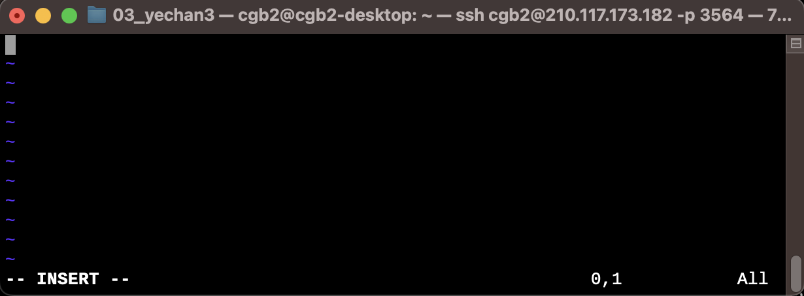

### step3

`-` `asdf` 입력

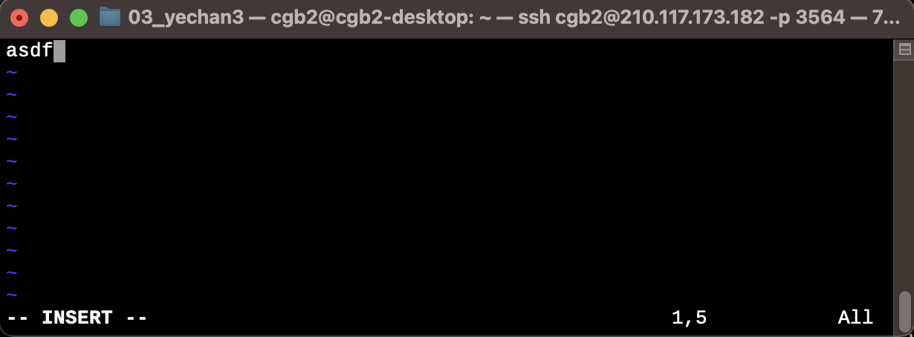

### step4

`-` 편집모드 종료, 노말모드 진입:`esc` 입력

- 아래에 `-- INSERT --` 라는 표현이 사라져있음. 이 상황에서 명령어 입력가능.

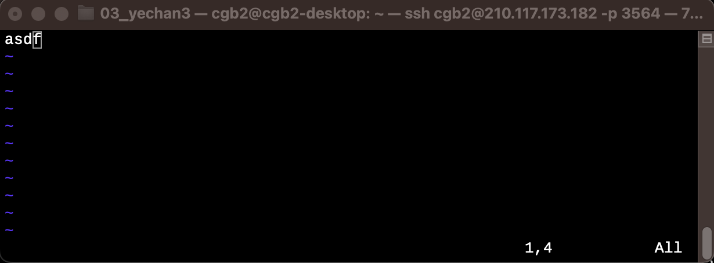

### step5

`-` 저장(w)+종료(q): `:` 입력하여 명령모드로 진입. `w`+ `q` + `Enter` 입력

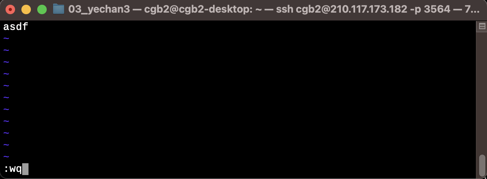
:::

### `h`,`l` -- 좌우로 커서이동

> 예제: vi 에서 좌우로 커서를 이동해보자.  

::: {.panel-tabset}
### step1

`-` 생성된 파일로 들어가기

```bash
vim test230803.txt 
```

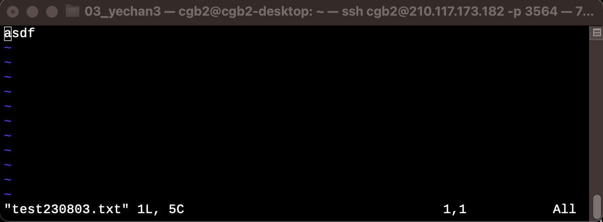

### step2

`-` `l`을 세번눌러서 오른쪽으로 3칸 이동

- `l`이 아니라 실수로 `ㅣ`를 누르면 동작하지 않음.
- 대충 화살표 눌러도 동작함

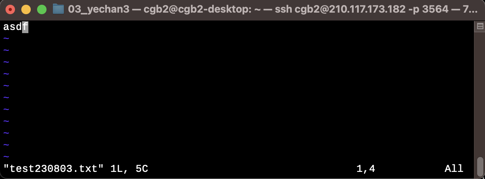

### step3

`-` `h`을 세번눌러서 왼쪽으로 3칸 이동

- `h`가 아니라 실수로 `ㅗ`를 누르면 동작하지 않음.
- 대충 화살표 눌러도 동작함
  
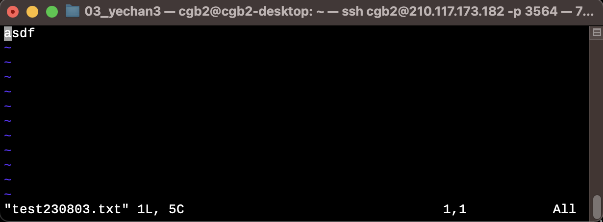
:::

### `o` -- 새로운라인 추가

> 예제: vi에서 새로운라인을 추가하고 `asdf2`입력하여 보자. 

::: {.panel-tabset}

### step1

`-` 준비작업: 명령모드에서 다음라인을 만들고 싶은 라인에 커서를 위치 


### step2

`-` `o`를 누른다: 편집모드로 전환 + 새로운 라인이 추가의 효과

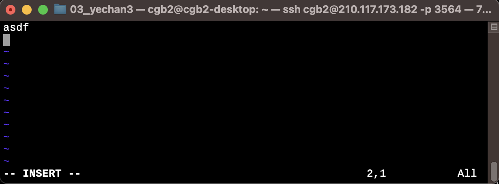

### step3

`-` `asdf2`입력 

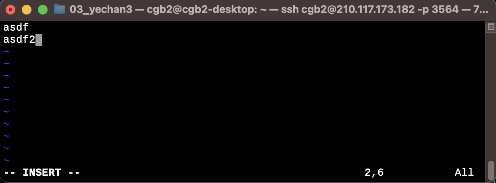
:::

### `j`,`k` -- 위 아래 이동 

> 예제: vi에서 `j`,`k`를 이용하여 커서를 이동하여 보자. (풀이는 생략)

### `0`, `$` -- home/end와 같은 기능 

> 예제: vi에서 home/end 와 같은 방식으로 커서를 이동해보자

::: {.panel-tabset}

### step1 

`-` 준비작업: 명령모드에서 home/end를 사용할 line으로 커서를 이동시킴

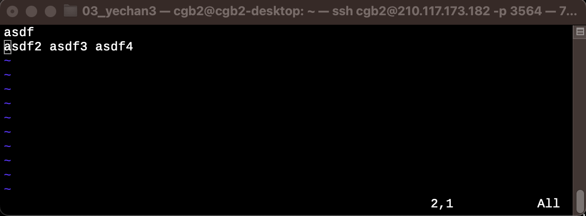

### step2

`-` 라인의 맨 마지막으로 가고싶다면? `$`를 입력한다. 

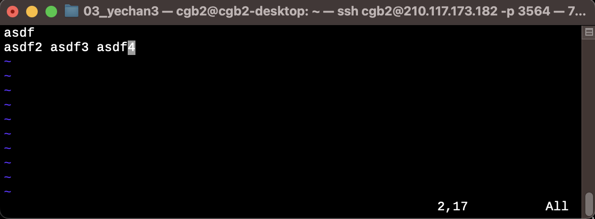


### step3

`-` 다시 라인의 맨 처음으로 가고싶다면? 숫자 `0`을 입력한다. 

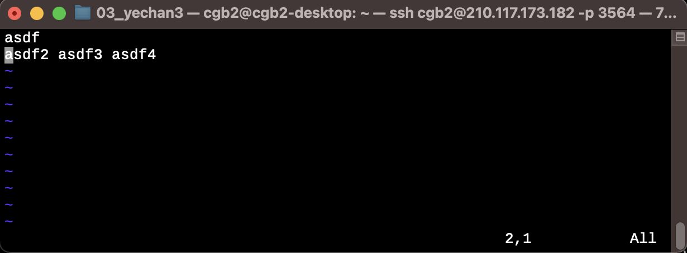
:::

### `yy`, `p` -- 라인복사, 붙여넣기 

> 예제: vi에서 하나의 줄을 복사하고 아래로 붙여넣기 해보자. 

::: {.panel-tabset}
### step1

`-` 복사하고싶은 라인으로 이동 + `yy` 입력

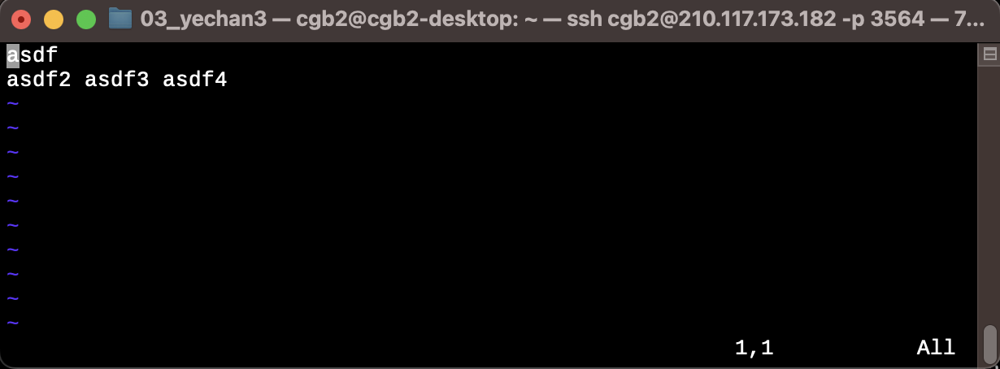

### step2

`-` 아래로 붙여넣을 라인으로 이동


### step3

`-` `p` 입력

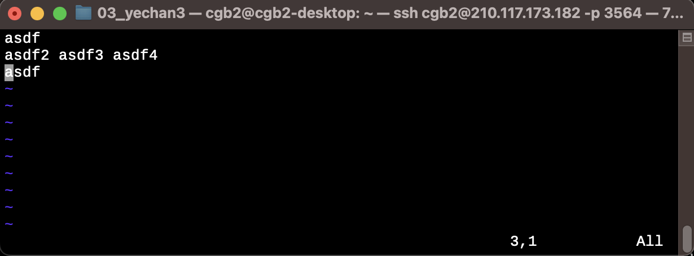
:::

### `w`,`b` -- 다음단어로 점프, 이전단어로 점프

> 예제: vi에서 `w`와 `b`를 이용하여 단어단위로 커서를 이동시켜보자. (풀이생략)

### `/` -- 단어 찾기 

> 예제: vi에서 원하는 단어는 찾아보자. 

::: {.panel-tabset}
### step1

`-` `/asdf2` 입력 

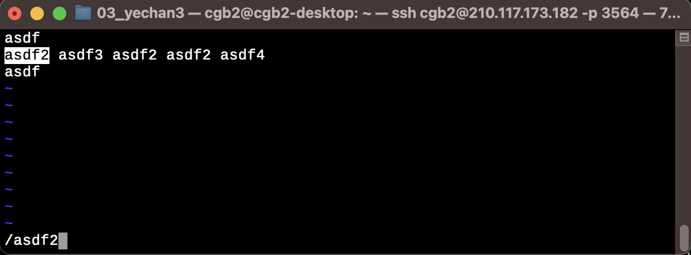

### step2

`-` `Enter` 입력 

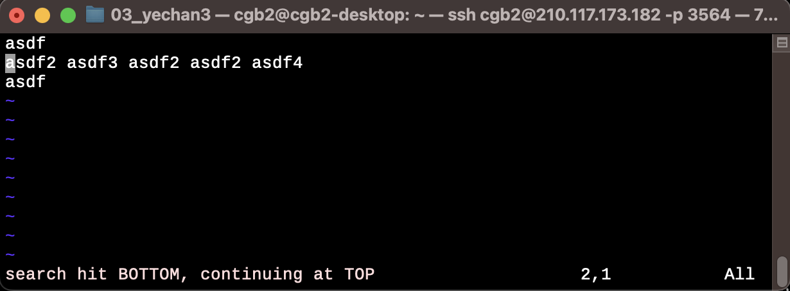

### step3

`-` `n` 입력하여 다음단어로 이동

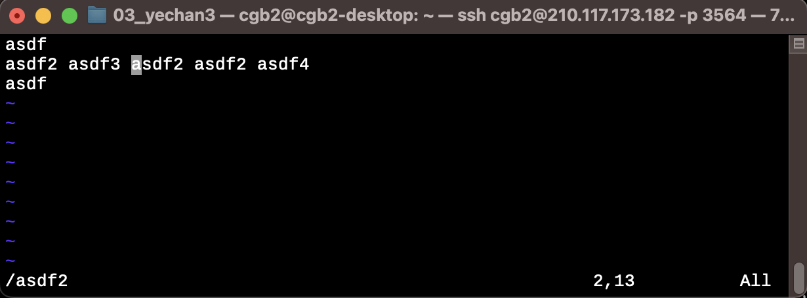

### step4

`-` `shift`+`n` 입력하여 이전단어로 이동 (`?`로 검색할 경우 `n`와 `shift`+`n`의 역할이 뒤바뀜)

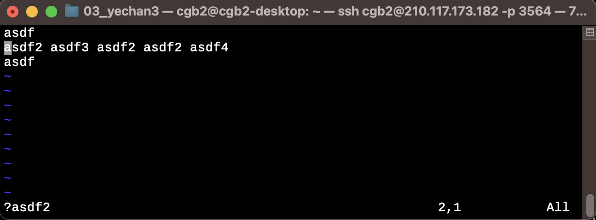
:::

## 모드 

### `esc`: normal 모드 

`-` 기능1: 되돌리기, 되돌리기를 되돌리기 

`-` 기능2: 커서이동 (기본) -- 방향키, 쉬프트+방향키, home/end, pageup/pagedown 으로 대체가능

- `k`,`j`,`h`,`l`: 상,하,좌,우
- `w`,`b`: 다음 단어의 시작으로 이동, 이전 단어의 시작으로 이동
- `0` (숫자 0), `$`: 줄의 맨 앞, 맨 끝으로 이동
- `control + d`, `control + u`: 반페이지씩 page down, page up
- `{`, `}`: 문단 시작, 끝으로 이동

`-` 기능3: 커서이동 (고급)

- `%`: 현재 괄호의 짝으로 이동
- `e`: 현재단어의 끝으로 이동 
- `gg`: 파일의 첫 줄로 이동
- `G`: 파일의 마지막 줄로 이동

`-` 기능4: 다른모드로 진입하기 위한 중간허브

- `v`,`V`: 선택모드, 줄단위선택모드로 변환
- `i`, `I`, `a`, `A`: 커서앞, 줄맨앞, 커서뒤, 줄맨뒤에서 삽입모드로 전환
- `r`, `R`: 한글자 수정후 복귀, 수정모드로 진입

`-` 기능5: 들여쓰기, 내어쓰기 

- `> + Enter`, `< + Enter`: 들여쓰기, 내어쓰기 

### `i`: 삽입모드

### `d`: 삭제모드

### `:`:  명령모드

### `/`: 검색모드

### `v`: 비주얼모드(선택모드)

### `R`: 수정모드

