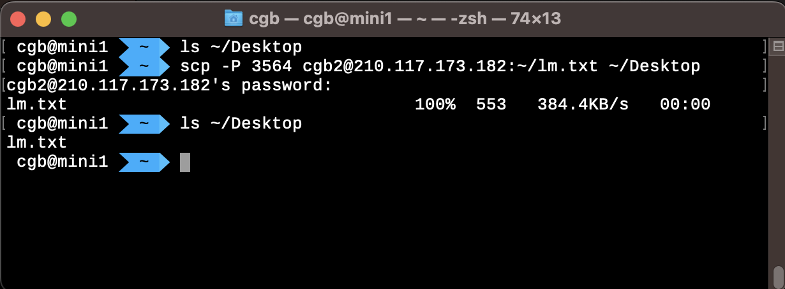

## 기본디렉토리 설명 

`/root` 

- 루트사용자의 홈 디렉토리
- sudo로도 들어갈 수 없음 

`/etc`

- 리눅스 시스템 전반적인 환경설정 파일들을 모은 디렉터리임. 
- 이 디렉터리의 모든 파일은 텍스트형식임. 
- `/etc/password` 사용자 계정정보 

`/home`

- 사용자의 홈 디렉터리

`/mnt` 

- 다른 파일 시스템이 파일 시스템에 연결되거나 마운트 되는 위치

`/media` 

- CD, USB 장치가 파일 시스템에 연결되거나 마운트되는 위치임

`/bin` 

- 시스템 부팅과 실행에 필요한 바이너리(=윈도도의 실행파일=macOS의 애플리케이션)들을 포함

`/lib` 

- 시스템 프로그램에서 사용하는 공유 라이브러리가 저장. 윈도우즈의 DLL과 비슷한 것. 

`/usr` 

- 사용자가 사용하는 모든 프로그램과 지원파일들 (Program files + 프로그램들의 설정값) 
- `/usr/bin` 리눅스 배포판이 설치한 실행 프로그램들이 있다. (여기에 R이 깔린다!!)
    - hp-align, hp-check, hp-config_usb-printer ... 
    - X11 
    - vi 
    - gcc
    - su, sudo 
    - sar
    - ssh, ssh-agent, ssh-keygen, .... 
    - nvidia-smi 

- `/usr/lib` 여기에는 `/usr/bin`에 있는 프로그램들을 위한 공유라이브러리가 저장된다. 여기에 R folder가 있다. (R패키지는 여기말고 다른데 깔림)

- `/usr/local/bin`  소스코드로 컴파일된 파일, 보통 비어있음 

- `/usr/local/lib/R/site-library` R패키지가 설치되어있음, 예를들면 tidyverse

## 기본명령어

### pwd, whoami

`-` 현재위치확인

```bash
(base) cgb2@cgb2-desktop:~$ pwd
/home/cgb2
```

`-` 유저확인

```bash
### 예시1: 유저확인 
(base) cgb2@cgb2-desktop:~$ whoami 
cgb2 

### 예시2: 루트권한 획득이후 유저확인 
(base) cgb2@cgb2-desktop:~$ sudo -i # 루트권한 획득
root@cgb2-desktop:~# whoami 
root 

### 예시3: 일반유저로 전환후 유저확인
root@cgb2-desktop:~# su - cgb2 
(base) cgb2@cgb2-desktop:~$ whoami
cgb2
```

### cd, ls

`-` 홈디렉토리로 이동 + 목록

```bash
(base) cgb2@cgb2-desktop:~/Dropbox$ cd ~
(base) cgb2@cgb2-desktop:~$ ls
Desktop                 julia-1.8.5
Documents               julia-1.8.5-linux-x86_64.tar.gz
Downloads               lm.txt
Dropbox                 nbdev_tst
Music                   quarto-1.0.37-linux-amd64.deb
Pictures                rstudio-server-2021.09.2-382-amd64.deb
Public                  scikit_learn_data
R                       snap
Templates               test.txt
Videos                  v3net
anaconda3               v3net-linux-3.6.10.11.805.tar.Z
blacklist-nouveau.conf  vscode_cli.tar.gz
code
```

`-` 루트로 이동 + 목록

```bash
(base) cgb2@cgb2-desktop:~/Dropbox$ cd /
(base) cgb2@cgb2-desktop:/$ ls
bin    dev   lib    libx32      media  proc  sbin  swapfile  usr
boot   etc   lib32  log         mnt    root  snap  sys       var
cdrom  home  lib64  lost+found  opt    run   srv   tmp
```

`-` ls 자세하게

```bash
(base) cgb2@cgb2-desktop:/$ ls -l
total 2097256
lrwxrwxrwx   1 root  root           7  2월 11  2022 bin -> usr/bin
drwxr-xr-x   3 root  root        4096  7월 27 12:19 boot
drwxrwxr-x   2 root  root        4096  2월 11  2022 cdrom
drwxr-xr-x  19 root  root        4480  7월 28 12:19 dev
drwxr-xr-x 143 root  root       12288  7월 27 21:08 etc
drwxr-xr-x   6 root  root        4096  7월  7 11:14 home
lrwxrwxrwx   1 root  root           7  2월 11  2022 lib -> usr/lib
lrwxrwxrwx   1 root  root           9  2월 11  2022 lib32 -> usr/lib32
lrwxrwxrwx   1 root  root           9  2월 11  2022 lib64 -> usr/lib64
lrwxrwxrwx   1 root  root          10  2월 11  2022 libx32 -> usr/libx32
drwxr-x---   2 root  root        4096  2월 11  2022 log
drwx------   2 root  root       16384  2월 11  2022 lost+found
drwxr-xr-x   2 root  root        4096  8월 19  2021 media
drwxr-xr-x   2 root  root        4096  8월 19  2021 mnt
drwxr-xr-x   4 jaein saned       4096  7월 16 11:21 opt
dr-xr-xr-x 418 root  root           0  7월 28 12:16 proc
drwx------   6 root  root        4096  7월 27 12:21 root
drwxr-xr-x  40 root  root        1220  8월  3 13:31 run
lrwxrwxrwx   1 root  root           8  2월 11  2022 sbin -> usr/sbin
drwxr-xr-x  14 root  root        4096  7월 16 11:10 snap
drwxr-xr-x   2 root  root        4096  8월 19  2021 srv
-rw-------   1 root  root  2147483648  2월 11  2022 swapfile
dr-xr-xr-x  13 root  root           0  7월 28 12:16 sys
drwxrwxrwt  19 root  root       20480  8월  3 13:29 tmp
drwxr-xr-x  14 root  root        4096  8월 19  2021 usr
drwxr-xr-x  15 root  root        4096  7월 30  2022 var
```

### -h, man 

`-` 도움말확인 

```bash
(base) cgb2@cgb2-desktop:~$ git --help
usage: git [--version] [--help] [-C <path>] [-c <name>=<value>]
           [--exec-path[=<path>]] [--html-path] [--man-path] [--info-path]
           [-p | --paginate | -P | --no-pager] [--no-replace-objects] [--bare]
           [--git-dir=<path>] [--work-tree=<path>] [--namespace=<name>]
           <command> [<args>]

These are common Git commands used in various situations:

start a working area (see also: git help tutorial)
   clone             Clone a repository into a new directory
   init              Create an empty Git repository or reinitialize an existing one

work on the current change (see also: git help everyday)
   add               Add file contents to the index
   mv                Move or rename a file, a directory, or a symlink
   restore           Restore working tree files
   rm                Remove files from the working tree and from the index
   sparse-checkout   Initialize and modify the sparse-checkout

examine the history and state (see also: git help revisions)
   bisect            Use binary search to find the commit that introduced a bug
   diff              Show changes between commits, commit and working tree, etc
   grep              Print lines matching a pattern
   log               Show commit logs
   show              Show various types of objects
   status            Show the working tree status

grow, mark and tweak your common history
   branch            List, create, or delete branches
   commit            Record changes to the repository
   merge             Join two or more development histories together
   rebase            Reapply commits on top of another base tip
   reset             Reset current HEAD to the specified state
   switch            Switch branches
   tag               Create, list, delete or verify a tag object signed with GPG

collaborate (see also: git help workflows)
   fetch             Download objects and refs from another repository
   pull              Fetch from and integrate with another repository or a local branch
   push              Update remote refs along with associated objects

'git help -a' and 'git help -g' list available subcommands and some
concept guides. See 'git help <command>' or 'git help <concept>'
to read about a specific subcommand or concept.
See 'git help git' for an overview of the system.
```

`-` 메뉴얼 확인 

```bash
(base) cgb2@cgb2-desktop:~$ man git
```

### cp, mv, mkdir, rm 

`-` 카피

```bash
cp file1 file2 # file1을 복사하여 file2를 새로 만듬. file2가 이미 있다면 file1의 내용을 덮어씀 
cp -r dir1 dir2 # dir1의 모든파일을 복사하여 dir2로 이동한뒤 붙어넣음. dir2가 없다면 새로 만듬. 기존의 dir2에 있던 파일이 삭제되는건 아님 
```

`-` 이동 

```bash
mv file1 file2 # file1을 이동하여 file2로 이름바꿈. file2가 이미 있다면 file1의 내용을 덮어씀 
mv -r dir1 dir2 # dir1의 모든파일을 잘라내어 dir2로 이동. 
```

`-` 디렉토리 생성 

```bash
mkdir temp
mkdir temp1, temp2, temp3 # 여러개를 만듬
```

`-` 삭제 

```bash
rm file1 # file1삭제 
rm -r file1 dir1 # file1삭제 dir1폴더삭제 
rm -rf file1 dir1 # 위와 동일한데 file1이나 dir1이 존재하지 않더라고 rm이 실행
```

`-` -v(verbose)를 쓰면 친절한 느낌이 든다. 

```bash
(base) cgb2@cgb2-desktop:~/Dropbox$ cp *.txt temppp -v
'colab.txt' -> 'temppp/colab.txt'
```

### scp

`-` cgb2에 있는 lm.txt를 cgb5로 옮김. 포트는 cgb5에 대응하는 포트

```bash
cgb2@cgb2-desktop:~$ scp -P 4653 lm.txt cgb5@210.117.173.185:~
```

`-` cgb2에 있는 lm.txt를 맥으로 가져옴. 포트는 cgb2에 대응하는 포트 



### find

`-` `Dropbox`라는 이름이 포함된 폴더 찾기 

```bash
find ~ -type d -name "Dropbox"
```

- 여기에서 `~`는 검색을 시작할 최상위 디렉토리를 쓴다.
- 여기에서 `-type d`는 디렉토리라는 의미이다. 

`-` `sy.tex`이라는 파일찾기 

```bash
find ~ -type f -name "sy.tex"
```

- 여기에서 `~`는 검색을 시작할 최상위 디렉토리를 쓴다.
- 여기에서 `-type d`는 디렉토리라는 의미이다. 

## 설치관련 

### wget 

`-` 인터넷에서 파일 다운로드 

```bash
wget https://download2.rstudio.org/server/bionic/amd64/rstudio-server-1.2.5033-amd64.deb
```

### gdebi, deb

`-` deb파일을 gdebi로 설치하는 방법

```bash
sudo gdebi rstudio-server-1.2.5033-amd64.deb
```

`-` deb파일을 dpkg를 이용하여 설치하는 방법

```bash
dpkg -i quarto-1.2.335-linux-amd64.deb # 설치
dpkg -r quarto # 삭제 
```

`-` gdebi, deb의 차이

- gdebi는 관련패키지를 모두 찾아서 설치 dpkg는 하나의 패키지만 설치. 즉 gdebi는 conda 느낌이고 dpkg는 pip 느낌 
- gdebi는 별도의 삭제옵션을 지원하지 않음. 따라서 gdebi로 설치한 deb을 삭제하려면 머리아플수도? 

`-` gdebi로 설치한 패키지를 삭제하는 방법

::: {.callout-note}

### Chat-GPT 답변

`gdebi`로 패키지를 삭제하는 것은 아쉽게도 직접적으로 지원하지 않습니다. `gdebi`는 주로 패키지를 설치할 때 사용되는 도구이며, 패키지의 삭제에는 사용되지 않습니다. 패키지를 삭제하려면 다른 도구인 `dpkg`나 패키지 관리자 명령을 사용해야 합니다.

패키지를 삭제하는 방법은 아래와 같습니다. 패키지를 삭제하기 전에 해당 패키지가 다른 의존하는 패키지에 영향을 주지 않는지 주의깊게 확인하시기 바랍니다.

**dpkg를 사용하여 패키지 삭제하기:**

```bash
sudo dpkg -r 패키지이름
```

여기서 `패키지이름`은 삭제하려는 패키지의 이름입니다. 이 명령을 실행하면 해당 패키지가 삭제됩니다.

**apt를 사용하여 패키지 삭제하기 (의존성 관리 포함):**

```bash
sudo apt remove 패키지이름
```

위 명령은 `apt`를 통해 패키지를 삭제하며, 의존성을 포함하여 관련된 패키지들도 자동으로 처리합니다. 이 방법은 일반적으로 패키지 삭제에 더 효과적입니다.

위의 방법 중 하나를 선택하여 패키지를 삭제할 수 있습니다. 패키지 삭제 시에는 주의하여 의존성 문제가 발생하지 않도록 해야 합니다.

:::

### apt 

```bash
sudo apt update
sudo apt list 
sudo apt install {openssh-server}  
sudo apt remove {r-base-core}
sudo apt purge {r-base* r-recommended r-cran-*}
sudo apt autoremove
```

`-` sudo apt-get과 sudo apt 차이? 별 차이 없는듯

- <https://askubuntu.com/questions/445384/what-is-the-difference-between-apt-and-apt-get>

> They are very similar command line tools available in Trusty (14.04) and later. apt-get and apt-cache's most commonly used commands are available in apt. apt-get may be considered as lower-level and "back-end", and support other APT-based tools. apt is designed for end-users (human) and its output may be changed between versions. 

### conda 

```bash
conda env list
conda list 
conda install -c conda-forge jupyterlab 
conda install -c conda-forge r-devtools
conda remove jupyterlab 
conda remove r-base
conda update -n py38r40 scipy # conda update scipy
```

### pip

```bash
pip
pip list
pip list > list.txt
pip freeze # 좀 더 자세히 나온다 
pip freeze > list.txt 
pip show matplotlib # 설치된패키지 정보가 나옴. 좋음.
pip install rpy2
pip install -r list.txt 
pip install dash==1.13.3
pip install jupyterlab "ipywidgets>=7.5"
pip install -U numpy
pip install --upgrade pip
pip install --upgrade tensorflow
pip uninstall matplotlib
```

## 리소스 모니터링 

```bash
df # disk 
free # memory 
nvidia-smi 
watch -n 5 nvidia-smi -a --display=utilization
top
sar -1 r 
```

## Appendix

### 덜 중요한 명령어

#### `file`

`-` 뭐하는 파일인지 알고싶다면? 

```bash
(base) cgb2@cgb2-desktop:~/Dropbox/03_yechan3$ file 1_essays.qmd 
1_essays.qmd: ASCII text
```

#### `date`, `cal`

`-` 날짜

```bash
(base) cgb2@cgb2-desktop:~$ date
2023. 08. 03. (목) 16:10:38 KST
```

`-` 달력

```bash
(base) cgb2@cgb2-desktop:~$ cal
      8월 2023         
일 월 화 수 목 금 토  
       1  2  3  4  5  
 6  7  8  9 10 11 12  
13 14 15 16 17 18 19  
20 21 22 23 24 25 26  
27 28 29 30 31         
```

