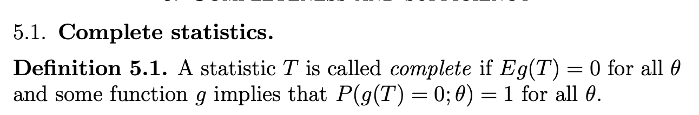
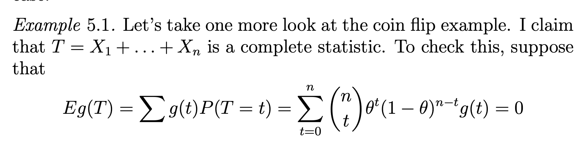

- ref: <http://www2.math.ou.edu/~cremling/teaching/lecturenotes/stat/ln5.pdf>

## 약속 

`-` 모수공간은 일반적으로 $d$차원을 가정. 확률변수는 일반적으로 $n$개를 가정

- $\boldsymbol \theta:=(\theta_1,\dots,\theta_d)$
- $X_1,\dots,X_n \sim F_{\boldsymbol \theta}$ 

`-` 확률변수 $X_1,X_2,\dots,X_n$ 은 간단히 ${\bf X}$로 표현, 실험치 $x_1,x_2,\dots,x_n$ 은 간단히 ${\bf x}$로 표현

`-` 통계량 $u_1(X_1,X_2,\dots,X_n)$ 은 간단히 $u_1({\bf X})$로 표현, 통계량의 실험치 $u_1(x_1,x_2,\dots,x_n)$ 은 간단히 $u_1({\bf x})$로 표현^[호그 앤 크레이그 스타일 (@hogg2013introduction)]

`-` $\boldsymbol \theta$에 대한 추정치는 $\hat{\boldsymbol \theta}={\bf Y}=(Y_1,\dots,Y_d)=(u_1({\bf X}), \dots, u_d({\bf X}))$로 표현. 

`-` $X_1,X_2,\dots,X_n \sim F_{\boldsymbol{\theta}}$ 의 결합확률 밀도함수 $f_{X_1,X_2,\dots,X_n}(x_1,x_2,\dots,x_n ; {\boldsymbol \theta})$ 는 간단히 $f_{\bf X}({\bf x};{\boldsymbol \theta})$ 로 표현

- 그런데 다음과 같이 표현하기도 함. $f_{\bf X}({\bf x};{\boldsymbol \theta})=f_{\bf X}({\bf x}, {\boldsymbol \theta})=f_{\bf X}({\bf x}|{\boldsymbol \theta})=f_{\bf X}({\bf x})=f({\bf x})$
- $f_{\bf X}({\bf x};{\boldsymbol \theta})$ 는 호그 앤 크레이그 스타일 (@hogg2013introduction), $f_{\bf X}({\bf x}, {\boldsymbol \theta})$ 은 비켈 앤 닥섬 스타일 (@bickel2015mathematical), 그리고 $f_{\bf X}({\bf x}|{\boldsymbol \theta})$ 는 카셀라 앤 버거 스타일(@casella2024statistical) 이다. 은근히 교재마다 고유의 특징이 있음. 
- 사실 $f_{\bf X}({\bf x}|{\boldsymbol \theta})$ 이 표현은 잘못된 표현이라 생각함. 조건부 pdf 처럼 보여서.. 

`-` $\{P_{\boldsymbol \theta}: {\boldsymbol \theta} \in {\bf \Theta}\}$ 의 모든 원소에 대하여 어떠한 state가 성립한다는 것은 $\forall {\boldsymbol \theta} \in {\bf \Theta}$ 에 대하여 어떠한 state가 성립한다는 말과 같음 

`-` $P_{\boldsymbol \theta}$가 더이상 ${\boldsymbol \theta}$에 대한 함수가 아니라면 간단하게 $P$라고 쓴다.^[카셀라 앤 버거 스타일(@casella2024statistical)]

`-` $\mathbb{E}_{\boldsymbol \theta}(X)$는 $\mathbb{E}_{\boldsymbol \theta}(X)=\int_{X \in {\cal X}} X dP_{\boldsymbol\theta}$ 을 의미한다.^[카셀라 앤 버거 스타일(@casella2024statistical)]

`-` ${\cal X}$ 는 density function의 정의역을 의미한다.^[카셀라 앤 버거 스타일(@casella2024statistical)]

## 추정이란?

`-` 통계학에서 말하는 추정이라는 것은 기본적으로 미지의 모수 ${\boldsymbol \theta}$ 를 하나의 수로 미루어 짐작하는 행위를 의미한다.^[엄밀하게 말하면 점추정일 경우를 의미한다. 이 문서에서 추정은 점추정을 의미한다] 

`-` 추정에서 전개하는 많은 논의는 확률측도들의 집합 $\big\{P_{\boldsymbol\theta}: {\boldsymbol\theta} \in {\bf \Theta} \big\}$ 을 우선적으로 상상해 놓아야 정확한 이해를 할 수 있다. 예를들어 $\boldsymbol\theta$ 를 잘 추정한다는 말의 의미는 $\big\{P_{\boldsymbol\theta}: {\boldsymbol\theta} \in {\bf \Theta} \big\}$ 에서 적절한 원소를 잘 선택한다는 것을 뜻한다. 또한 추정량이 가져야 하는 여러가지 좋은 성질에 대한 의미도 다시 생각해볼 수 있다. 추정량이 가져야할 좋은 성질은 어떠한 수식의 형태로 나타나는데, 그러한 수식은 true 가 $\big\{P_{\boldsymbol\theta}: {\boldsymbol\theta} \in {\bf \Theta} \big\}$ 중 어떠한 원소라고 할지라도 항상 성립해야 한다. 즉 임의의 $P_{\boldsymbol\theta} \in \big\{P_{\boldsymbol\theta}: {\boldsymbol\theta} \in {\bf \Theta} \big\}$ 에 대하여 성립해야 한다. 예를들어 불편성의 경우 $\mathbb{E}(\hat{\boldsymbol \theta})=\boldsymbol\theta$ 라는 수식이 떠오를텐데, 이 수식은 임의의 $P_{\boldsymbol\theta} \in \big\{P_{\boldsymbol\theta}: {\boldsymbol\theta} \in {\bf \Theta} \big\}$ 혹은 임의의 ${\boldsymbol \theta} \in {\bf \Theta}$ 에 대하여 성립해야 한다. 아래는 호그 앤 크레이그의 수리통계학에서 발췌한 부분이다. 

:::{.callout-note}
### Hogg and Craig 5e 에서 발췌
확률밀도함수족 $\big\{f(x;\theta): {\boldsymbol \theta} \in {\bf \Theta}\big\}$ 를 고려하자. 실험자는 이 함수족의 하나의 요소가 확률변수의 p.d.f. 이도록 택할 필요가 있다. 즉 실험자는 ${\boldsymbol \theta}$의 점추정치를 필요로 한다. $X_1,X_2,\dots,X_n$은 확률밀도함수족 $\big\{f(x;{\boldsymbol \theta}): {\boldsymbol \theta} \in {\bf \Theta} \big\}$ 의 하나의 요소 (알지 못하는 요소) 인 p.d.f. 를 갖는 분포에서 추출한 확률표본이라 하자. 즉 이 표본은 p.d.f. $f(x; {\boldsymbol \theta}), {\boldsymbol \theta} \in {\bf \Theta}$ 인 분포에서 나온 것이다. 문제는 통계량 

- $\hat{\theta}_1=Y_1=u_1(X_1,X_2,\dots,X_n)=u_1({\bf X})$
- $\dots$ 
- $\hat{\theta}_d=Y_d=u_d(X_1,X_2,\dots,X_n)=u_d({\bf X})$
  
을 정의하는 것이므로 $(x_1,x_2,\dots,x_n)$ 이 $(X_1,X_2,\dots,X_n)$ 의 실험치로 관찰되었다면 수 $(y_1,\dots,y_d)$ 는 $(\theta_1,\dots,\theta_d)$ 의 좋은 점추정치가 될 것이다. 
:::

예전에 공부할때는 왜 확률밀도함수족이라는 개념을 굳이 설명하는 것인가 의문이었는데, (복잡하기만 하다고 생각되었다) 이 확률밀도함수족이라는 개념이 미리 전제되지 않으면 이후의 논의를 정확하게 이해하는 것이 매우 어려워진다는 것을 오랜 시간이 지나고 알게 되었다.

## 불편추정량 

`# 정의` -- UB

연속형 혹은 이산형 확률변수 $X_1,X_2,\dots,X_n$는 족(family) $\big\{P_{\boldsymbol \theta}: {\boldsymbol \theta} \in {\bf \Theta}\big\}$ 중 하나의 원소에서 추출한 확률표본이라고 하자. 만약에 모든 $P_{\boldsymbol\theta} \in \big\{P_{\boldsymbol\theta}: {\boldsymbol\theta} \in {\bf \Theta}\big\}$ 에 대하여 

$$\mathbb{E}_{\boldsymbol\theta}[{\bf Y}] =\int {\bf Y} dP_{\boldsymbol\theta}= {\boldsymbol\theta} \quad \cdots (\star)$$

을 만족하는 ${\bf Y}=(Y_1,\dots,Y_d)=(u_1({\bf X}),\dots,u_d({\bf X}))$ 가 있다면 ${\bf Y}$는 ${\boldsymbol \theta}$에 대한 불편추정량이라고 한다. 여기에서 중요한 점은 임의의 $P_{\boldsymbol \theta}$에 대하여 수식 $(\star)$를 고려해야한다는 점이다.

`#`

`# 정의` -- UB 

위의 정의에서

- $\hat{\boldsymbol\theta}:={\bf Y}=(u_1({\bf X}),\dots,u_d({\bf X}))$ 이고 
- 임의의 $P_{\boldsymbol \theta} \in \big\{P_{\boldsymbol \theta}: {\boldsymbol \theta} \in {\bf \Theta}\big\}$ 를 고려한다는 것은 임의의 ${\boldsymbol \theta} \in {\bf \Theta}$ 를 고려한다는 것과 같은 말

임을 고려한다면 암기를 위해서 정의를 아래와 같이 바꾸어 정리할 수 있겠다. 

$$\hat{\boldsymbol\theta} \text{ is UB of } {\boldsymbol \theta} \Leftrightarrow \forall {\boldsymbol \theta} \in {\bf \Theta}: \mathbb{E}_{\boldsymbol\theta}[\hat{\boldsymbol\theta}]=\boldsymbol\theta$$

UB라는 의미를 좀 더 강조하여 아래와 같이 표현하는 것도 가능하다. 

$$\hat{\boldsymbol\theta}^{UB} \text{ is UB of } {\boldsymbol \theta} \Leftrightarrow \forall {\boldsymbol \theta} \in {\bf \Theta}: \mathbb{E}_{\boldsymbol\theta}[\hat{\boldsymbol\theta}^{UB}]=\boldsymbol\theta$$

`#`

`# 예제1` 아래와 같은 상황을 가정하자. 

$$X_1,\dots, X_n \overset{iid}{\sim} N(\theta,1)$$

`ex1` -- $\hat{\theta}_1=0$ 은 $\theta=0$ 일 경우에는 $E_{\theta}(\hat{\theta}_1)=\theta$ 를 만족하지만 그 외의 경우에는 $E_{\theta}(\hat{\theta}_1)\neq\theta$ 이므로 UB가 아니다. 

`ex2` -- $\hat{\theta}_2=X_1$ 은 UB이다. 

`ex3` -- $\hat{\theta}_3=\frac{X_1+X_2}{2}$ 역시 UB이다. 

`ex4` -- $\hat{\theta}_4=X_1+X_2-X_3$ 역시 UB이다. 

`ex5` -- $\hat{\theta}_5=-99X_1+100X_2$ 역시 UB이다. 

`ex6` -- $\hat{\theta}_6=\frac{X_1+0}{2}$ 은 1과 동일한 이유로 UB가 아니다. 

`ex7` --$\hat{\theta}_7=\bar{X}$는 UB이다. 

`#`

## 최소분산불편추정량 

`# Motive` -- 아래의 상황을 다시 복습하자. 

$$X_1, \dots, X_n \overset{iid}{\sim} N(\theta,1)$$

`ex2` -- $\hat{\theta}_2=X_1$

`ex3` -- $\hat{\theta}_3=\frac{X_1+X_2}{2}$

`ex4` -- $\hat{\theta}_4=X_1+X_2-X_3$

`ex5` -- $\hat{\theta}_5=-99X_1+100X_2$

`ex7` -- $\hat{\theta}_7=\bar{X}$

위의 예제에서 $\hat{\theta}_2,\hat{\theta}_3,\hat{\theta}_4,\hat{\theta}_5,\hat{\theta}_7$ 중에 좋은 추정치는 무엇일까? 각각의 분산을 계산해보면 $\hat{\theta}_7=\bar{X}$ 인 경우가 $\mathbb{V}_{\theta}(\hat{\theta}_7)=\frac{1}{n}$ 로 가장 분산이 작음을 알 수 있는데, 이를 미루어 보면 $\hat{\theta}_7$ 이 가장 좋은 추정치임을 알 수 있다. 이처럼 비편향 추정량중에서 최소분산을 가지는 추정량은 좋은 추정량인데 이를 최소분산비편향추정량 (MVUE) 라고 한다. 

`#`

`-` 의문: 왜 비편향추정량만 모아서 그중에서 최소분산을 구할까?

> $\hat{\theta}_1$와 같은 추정량은 $\mathbb{V}_{\theta}(\hat{\theta}_1)=0$ 이므로 그냥 최소분산을 만족한다. 따라서 이러한 추정량은 제외해야 좋은 추정량을 고르는 게임이 성립함. 

`# 정의` -- MVUE 

${\boldsymbol \theta}$ 에 대한 최소분산비편향추정량 $\hat{\boldsymbol \theta}^{MVUE}=\big(u_1({\bf X}),\dots,u_d({\bf X})\big)$ 찾는 일은 모든 ${\boldsymbol \theta} \in {\bf \Theta}$ 에 대하여 아래의 조건을 만족하는 적당한 함수 $u_1,\dots,u_d$를 찾는 일과 같다. 

1. `불편성` --  $\hat{\boldsymbol \theta}^{MVUE} \in  \hat{\bf \Theta}^{UB}$

2. `최소분산성` -- $\forall \hat{\boldsymbol \theta} \in \hat{\bf \Theta}^{UB}: ~\mathbb{V}_{\boldsymbol\theta}\big[\hat{\boldsymbol \theta}^{MVUE}\big] \leq \mathbb{V}_{\boldsymbol\theta}\big[\hat{\boldsymbol \theta}\big]$

여기에서 $\hat{\bf \Theta}^{UB}=\hat{\bf \Theta}^{UB}:=\{\hat{\boldsymbol \theta}:~ \mathbb{E}_{\boldsymbol\theta}[\hat{\boldsymbol \theta}] ={\boldsymbol \theta}\}$는 ${\boldsymbol\theta}$에 대한 비편향추정량들의 집합을 의미하며, $\leq$ 는 Positive Semi-Definite Ordering을 의미한다. 

`#`

`-` 정리하면 고정된 ${\boldsymbol \theta} \in {\bf \Theta}$ 에 대하여 MVUE를 구하는 방법은 아래와 같다. 

1. 고정된 $\boldsymbol\theta$ 에 대한 모든 비편향추정량을 구한다. 즉 집합 $\hat{\bf\Theta}^{UB}$ 를 구한다.
2. 그리고 집합의 각 원소에 $\hat{\boldsymbol\theta} \in \hat{\bf\Theta}_{UB}$ 에 대하여 $\mathbb{V}(\hat{\boldsymbol\theta})$ 를 구한뒤
3. $\mathbb{V}(\hat{\boldsymbol\theta})$ 가 가장 작은 $\hat{\boldsymbol\theta}$ 를 선택한다. 

`-` 불만: 사실상 정의그대로 MVUE를 구하는건 거의 불가능에 가깝다. 따라서 적당한 이를 쉽게 하기 위한 적당한 이론이 필요하다. 

`# 이론1` -- CRB

크래머라오 하한값(편의상 ${\bf L}^\star$이라고 하자)이라고 있는데, 이는 ${\bf \Theta}^{UB}$ 에 존재하는 모든 추정량에 대한 분산의 하한값을 제공한다.^[사실 ${\bf \Theta}^{UB}$가 아닌 집합에 대해서도 하한값을 제공함] 즉 아래가 성립한다. 

> ${\bf L}^\star$ is Cramer-Rao lower bound $\Rightarrow$ $\forall \hat{\boldsymbol \theta} \in \hat{\bf \Theta}^{UB}:~ \mathbb{V}_{\boldsymbol \theta}(\hat{\boldsymbol\theta}) \geq {\bf L}^\star$

여기에서 $\geq$는 Positive Semi-Definite Ordering 을 의미한다. ${\bf L}^{\star}$는 이후에 ${\bf L}^{\star}:=I({\boldsymbol \theta})^{-1}$ 임이 밝혀진다. 

`#`

`-` 따라서 이론1을 이용하면 아래의 논리전개를 펼 수 있다. 

1. ${\bf L}^\star$를 구한다. 
2. 왠지 MVUE가 될 것 같은 $\hat{\boldsymbol \theta}$을 하나 찍고 그것의 분산 $\mathbb{V}_{\boldsymbol \theta}(\hat{\boldsymbol \theta})$를 구한다. 
3. 만약에 $\mathbb{V}_{\boldsymbol \theta}(\hat{\boldsymbol \theta})={\bf L}^\star$를 만족하면 그 $\hat{\boldsymbol\theta}$이 MVUE라고 주장할 수 있다. 

그렇지만 이러한 논리전개를 펴는것이 어려운 경우가 있다. 그 이유는 3의 과정이 만족하지 않는 경우가 있기 때문이다. 모든 MVUE 가 CRB 를 만족하면 좋겠으나 그렇지 않다. 즉 MVUE 이지만 CRB를 만족하지 않는 추정량이 존재한다. 이러한 추정량에 대하여 MVUE임을 보이기 위해서는 이론1이 아닌 다른것이 필요하다. 

`# 이론2` -- CSS

`#`

## 충분통계량

### 언어 그대로의 설명

`# 충분통계량 설명1`

연속형 혹은 이산형 확률변수 $X_1,X_2,\dots,X_n$는 족(family) $\big\{P_{\boldsymbol\theta}: {\boldsymbol\theta} \in {\bf \Theta}\big\}$ 중 하나의 원소에서 추출한 확률표본이라고 하자. 실제 true가 $\big\{P_{\boldsymbol\theta}: {\boldsymbol\theta} \in {\bf\Theta}\big\}$ 의 어떤 원소이든 상관없이,

> 통계량 $Y_1=u_1(X_1,X_2,\dots,X_n), \dots, Y_d=u_d(X_1,X_2,\dots,X_n)$ 만 **기억**하면 ${\boldsymbol\theta}=(\theta_1,\dots,\theta_d)$를 추정하기에 "충분" 할 것 같다.. 

라는 생각이 드는 통계량 $Y_1,\dots,Y_d$ 이 있을 수 있다. 이러한 통계량의 개념을 수식적으로 구체화하여 이를 $\boldsymbol\theta$ 에 대한 충분통계량 (CS) 이라고 하고 싶다. 

`#`

`# 예시1` -- $X_1 \sim N(\theta,1)$ 

$X_1$은 $\theta$ 의 SS 이다. (하나밖에 없으니 그거라도 기억해야지) 

`#`

`# 예시2` --  $X_1,X_2 \sim N(\theta,1)$ 

당연히 $\hat{\theta}=(X_1,X_2)$ 라고 한다면 $\hat{\theta}$ 은 $\theta$ 의 SS 이다. (둘다 기억하면 당연히 $\theta$를 추정함에 있어서 충분하기 때문임) 예제1번과 연결하여 생각하면 결국 "모든 샘플을 기억하면, $\theta$를 추정하는데 충분" 하므로 모든 샘플은 당연히 $\theta$의 충분통계량이다. 

그렇지만 좀 더 생각해보면 굳이 값 두개를 기억하기보다 $\frac{1}{2}(X_1+X_2)$의 값만 기억해도 왠지 $\theta$를 추정하기에 충분할것 같다. 실제로 $\hat{\theta} = \frac{1}{2}(X_1+X_2)$ 역시 $\theta$의 충분통계량이다. 

그런데 좀 더 생각해보니까 $X_1+X_2$의 값만 기억해도 $\frac{1}{2}(X_1+X_2)$를 나중에 만들 수 있다. (1/2만 곱하면 되니까) 따라서 $X_1+X_2$만 기억해도 왠지 $\theta$를 추정하기에 충분할것 같다. 실제로 그러하다. (충분통계량의 1:1함수는 충분통계량) 

`#`

`# 예시3`-- $X_1,\dots,X_n \sim N(\theta,1)$ 

모든 샘플은 항상 $\theta$에 대한 충분통계량이므로 $\hat{\theta}=(X_1,X_2,\dots,X_n)$는 $\theta$의 충분통계량이다. 

하지만 $n$ 개의 숫자를 기억할 필요 없이 $\sum_{i=1}^{n} X_i$ 하나의 숫자만 기억해도 왠지 $\theta$를 추정하기에 충분할 것 같다. 실제로 $\hat{\theta} = \sum_{i=1}^{n} X_i$ 역시 $\theta$의 충분통계량이다. 

`# 예시4` -- $X_1,X_2 \sim {\cal B}er(\theta)$ 

모든 샘플은 $\theta$에 대한 충분통계량이므로 당연히 $\hat{\theta}=(X_1,X_2)$은 $\theta$의 충분통계량이다. 

사실 모든 샘플을 기억하기 보다 $X_1+X_2$의 값만을 기억해도 $\theta$를 추정하기에 충분해보이는데, 실제로 그러하다. 즉 $\hat{\theta}=X_1+X_2$ 는 $\theta$ 충분통계량이다. 

기억량이 적을수록 유리하므로 사실 $(X_1,X_2)$의 실현치를 모두 기억하는 것 보다 $X_1+X_2$의 실현치값만 기억하는게 유리하다. 따라서 둘 중에서는 $X_1+X_2$ 가 더 좋은 충분통계량이다. (그리고 이 개념을 발전시킨것이 최소충분통계량이다.) 

$\hat{\theta}=X_1$은 $\theta$의 충분통계량이 아닐 것 같다. 왜냐하면 비율 $\theta$의 값을 추정함에 있어서 $X_2$값도 있다면 $\theta$의 추정이 도움이 될 것이라 여겨지기 때문이다. 실제로 $\hat{\theta}=X_1$은 $\theta$의 충분통계량이 아니다. 똑같은 논리로 $\hat{\theta}=X_2$ 역시 충분통계량이 아니다. 

`#`

:::{.callout-note}
$X_1,\dots,X_n \sim F_{\boldsymbol \theta}$ 인 경우 모든 샘플 $X_1,\dots,X_n$ 은 항상 ${\boldsymbol \theta}$ 의 충분통계량이다. 
:::

:::{.callout-note}
$X_1,\dots,X_n \overset{iid}{\sim} F_{\boldsymbol \theta}$ 인 경우 모든 순서통계량 $X_{(1)},\dots,X_{(n)}$ 역시 항상 ${\boldsymbol \theta}$ 의 충분통계량이다. 
:::

### "충분하다"라는 언어의 수식화

`-` ***왠지 충분할 것 같은 느낌*** 을 정의해보자. 

`# 예제1`

> 이 예제는 $(X_1,\dots,X_n)$ 의 결합확률분포에서 관찰한 샘플 $(x_1,\dots,x_n)$ 을 바탕으로 모수를 추정하는 기본 rationale을 설명한다.

아래와 같은 상황을 가정하자.

$$X_1,X_2 \sim {\cal B}er(\theta)$$

일반적으로 

- $\mathbb{P}_{\theta}(X_1=0,X_2=0)=(1-\theta)^2$
- $\mathbb{P}_{\theta}(X_1=0,X_2=1)=\theta(1-\theta)$ 
- $\mathbb{P}_{\theta}(X_1=1,X_2=0)=(1-\theta)^2$ 
- $\mathbb{P}_{\theta}(X_1=1,X_2=1)=\theta^2$ 

와 같은 확률들은 $\theta$가 unknown일 때 하나의 숫자로 정할 수 없다. 예를들어 $\theta=0$ 이라면 아래와 같을 것이고 

- $\mathbb{P}(X_1=0,X_2=0)=1$
- $\mathbb{P}(X_1=0,X_2=1)=0$ 
- $\mathbb{P}(X_1=1,X_2=0)=0$ 
- $\mathbb{P}(X_1=1,X_2=1)=0$ 

$\theta=1/2$ 이라면 아래와 같을 것이다. 

- $\mathbb{P}(X_1=0,X_2=0)=1/4$
- $\mathbb{P}(X_1=0,X_2=1)=1/4$ 
- $\mathbb{P}(X_1=1,X_2=0)=1/4$ 
- $\mathbb{P}(X_1=1,X_2=1)=1/4$

즉 $X_1,X_2$의 결합확률분포는 $\theta$가 변함에 따라 같이 변화한다. 이를 이용해 우리는 $X_1,X_2$의 결합확률분포에서 관찰한 샘플들을 이용하여 $\theta$의 값을 역으로 추론한다. 

> 요약: 일반적으로 $\theta$ 는 $(X_1,X_2,\dots,X_n)$ 의 joint distribution 에서 얻은 샘플 $(x_1,x_2,\dots,x_n)$ 에서 추정한다. 

`#`

`# 예제2` 

> 만약에 어떠한 "특수한 정보를 알고 있을 경우" $X_1,X_2$의 결합확률분포를 완벽하게 기술할 수 있을까?

`-` 경우1: $\theta$를 알고 있을 경우. $(X_1,X_2)$의 조인트를 완벽하게 기술할 수 있다. 예를들어 $\theta=1/2$일 경우는 아래와 같다.

- $\mathbb{P}(X_1=0,X_2=0 ~;~ \theta=1/2)=1/4$
- $\mathbb{P}(X_1=0,X_2=1 ~;~ \theta=1/2)=1/4$ 
- $\mathbb{P}(X_1=1,X_2=0 ~;~ \theta=1/2)=1/4$ 
- $\mathbb{P}(X_1=1,X_2=1 ~;~ \theta=1/2)=1/4$

`-` 경우2: $X_1,X_2$의 realization을 알고 있을 경우. $(X_1,X_2)$의 조인트를 완벽하게 기술할 수 있다. 예를들어 $X_1=0,X_2=1$일 경우는 아래와 같다.

- $\mathbb{P}(X_1=0,X_2=0 ~\big|~ X_1=0,X_2=0)=0$
- $\mathbb{P}(X_1=0,X_2=1 ~\big|~ X_1=0,X_2=1)=0$ 
- $\mathbb{P}(X_1=1,X_2=0 ~\big|~ X_1=1,X_2=0)=1$ 
- $\mathbb{P}(X_1=1,X_2=1 ~\big|~ X_1=1,X_2=1)=0$

`-` 경우3: $(X_1+X_2)(\omega)$의 realization을 알고 있을 경우. 이때도 ***매우 특이하게*** $(X_1,X_2)$ 의 조인트를 완벽하게 기술할 수 있다.

***case1: $X_1+X_2=0$일 경우***

- $\mathbb{P}(X_1=0,X_2=0 ~\big|~ X_1+X_2=0)=1$
- $\mathbb{P}(X_1=0,X_2=1 ~\big|~ X_1+X_2=0)=0$ 
- $\mathbb{P}(X_1=1,X_2=0 ~\big|~ X_1+X_2=0)=0$ 
- $\mathbb{P}(X_1=1,X_2=1 ~\big|~ X_1+X_2=0)=0$

***case2: $X_1+X_2=1$일 경우***

- $\mathbb{P}(X_1=0,X_2=0 ~\big|~ X_1+X_2=1)=0$
- $\mathbb{P}(X_1=0,X_2=1 ~\big|~ X_1+X_2=1)=1/2$ 
- $\mathbb{P}(X_1=1,X_2=0 ~\big|~ X_1+X_2=1)=1/2$ 
- $\mathbb{P}(X_1=1,X_2=1 ~\big|~ X_1+X_2=1)=0$

***case3: $X_1+X_2=2$일 경우***

- $\mathbb{P}(X_1=0,X_2=0 ~\big|~ X_1+X_2=2)=0$
- $\mathbb{P}(X_1=0,X_2=1 ~\big|~ X_1+X_2=2)=0$ 
- $\mathbb{P}(X_1=1,X_2=0 ~\big|~ X_1+X_2=2)=0$ 
- $\mathbb{P}(X_1=1,X_2=1 ~\big|~ X_1+X_2=2)=1$

`-` 경우4: $X_1$의 realization만 알고 있을 경우. 이때는 $(X_1,X_2)$ 의 조인트를 완벽하게 기술할 수 없다. 

***case1: $X_1=0$일 경우***

- $\mathbb{P}_{\theta}(X_1=0,X_2=0 ~\big|~ X_1=0)=1-\theta$
- $\mathbb{P}_{\theta}(X_1=0,X_2=1 ~\big|~ X_1=0)=\theta$ 
- $\mathbb{P}_{\theta}(X_1=1,X_2=0 ~\big|~ X_1=0)=0$ 
- $\mathbb{P}_{\theta}(X_1=1,X_2=1 ~\big|~ X_1=0)=0$

***case2: $X_1=1$일 경우***

- $\mathbb{P}_{\theta}(X_1=0,X_2=0 ~\big|~ X_1=1)=0$
- $\mathbb{P}_{\theta}(X_1=0,X_2=1 ~\big|~ X_1=1)=0$ 
- $\mathbb{P}_{\theta}(X_1=1,X_2=0 ~\big|~ X_1=1)=1-\theta$ 
- $\mathbb{P}_{\theta}(X_1=1,X_2=1 ~\big|~ X_1=1)=\theta$

종합해보면 경우1,경우2,경우3은 경우4와 구분되는 어떠한 공통점을 가지고 있다 볼 수 있다. 특징은 결합확률분포가 $\theta$에 대한 함수로 표현되지 않는다는 것이다. 하나씩 살펴보면

- 경우1: 당연히 $\theta$를 줬으니까 $(X_1,X_2)$의 조인트는 $\theta$에 의존하지 않음. 
- 경우2: $X_1,X_2$를 줬음. $(X_1,X_2)$의 조인트는 $\theta$에 의존하지 않음. 
- 경우3: $X_1+X_2$를 줬음. $(X_1,X_2)$의 조인트는 $\theta$에 의존하지 않음. 

이렇게보면 경우1과 경우2,3은 또 다시 구분된다. 경우1은 **$\theta$에 대한 완전한 정보를 준 상황**이므로 당연히 조인트는 $\theta$에 의존하지 않는다. 경우2-3은 $\theta$를 주지 않았음에도 조인트가 $\theta$에 의존하지 않는 매우 특별해보이는 상황이다. 따라서 이를 통해서 유추하면 

> 경우2에서는 $(X_1,X_2)$이, 그리고 경우3에서는 $X_1+X_2$가 $\theta$에 대한 완전한 정보를 대신하고 있는것 아닐까? 

라는 생각이 든다. 정리하면 

- 경우2: $(X_1,X_2)$을 주는 것은 $\theta$의 값을 그냥 알려주는 것과 대등한 효과 
- 경우3: $X_1+X_2$를 주는 것은 $\theta$의 값을 그냥 알려주는 것과 대등한 효과 

라고 해석할 수 있다.

`#`

### 정의

`# 충분통계량 설명2` -- 정의

연속형 혹은 이산형 확률변수 $X_1,X_2,\dots,X_n$는 족(family) $\big\{P_{\boldsymbol\theta}: {\boldsymbol\theta} \in {\bf \Theta}\big\}$ 중 하나의 원소에서 추출한 확률표본이라고 하자. 어떠한 통계량 ${\bf Y}$의 값을 줬을때, $(X_1,X_2\dots,X_n)$의 결합확률분포가 (마치 ${\boldsymbol\theta}$의 값을 알려준 것 마냥) ${\boldsymbol\theta}$ 에 의존하지 않으면 그 통계량 ${\bf Y}$ 는 ${\boldsymbol\theta}$ 의 값을 알려준것과 대등한 효과라고 볼 수 있다. 이러한 일이 $\big\{P_{\boldsymbol\theta}: {\boldsymbol\theta} \in {\bf \Theta}\big\}$ 의 아무원소에서나 성립한다면 그 통계량 ${\bf Y}$를 $\boldsymbol\theta$ 의 충분통계량이라고 한다. 

`#`

:::{.callout-note}

[통계학에서 ***conditional*** 이라는 단어가 가지는 의미]

아래와 같은 표현들을 고려하자.

`-` $\mathbb{P}\big(X=x|\bigstar\big)$

`-` $F_{X}(x|\bigstar)$

`-` $f_X(x|\bigstar)$

`-` $\mathbb{E}(X|\bigstar)$

수리적으로 $\bigstar$ 자리에 올 수 있는 것은 이벤트 혹은 시그마필드이다. 

위의 식에서 $\bigstar$는 **주어진정보**로 해석할 수 있다. (통계적해석) 이 **주어진정보**는 $\theta$ 에 관련된 정보를 의미한다. 예를 들면 이항분포에서 $X_1+X_2=1$. 이것은 최소한 $\theta>0$ 임을 암시한다. 

또한 위의 식에서 $\bigstar$는 **제약조건**으로 해석할 수 있다. (수학적해석) 나는 제약조건이라는 해석을 좀 더 선호하는 편인데 이는 여러가지 해석에 비교적 간단히 적용할 수 있기 때문이다. 예를들어 (일반적이진 않지만) $X|\bigstar$ 와 같은 노테이션을 상상할 수 있다. 이는 $\bigstar$ 라는 제약조건을 지키며 정의되는 확률변수로 해석할 수 있다.

:::

### 분해정리 

### 연습문제 

| **분포**           | **PDF/PMF**                                                                                       | **추정의 대상**                     | **충분통계량**                                     |
|---------------------|--------------------------------------------------------------------------------------------------|-------------------------------------|---------------------------------------------------|
| **정규분포**       | $f(x|\mu, \sigma^2) = \frac{1}{\sqrt{2\pi\sigma^2}} \exp\left(-\frac{(x-\mu)^2}{2\sigma^2}\right)$ | $(\mu, \sigma^2)$                  | $\left(\sum X_j, \sum X_j^2\right)$              |
| **이항분포**       | $f(x|n, p) = \binom{n}{x} p^x (1-p)^{n-x}$                                                       | $p$                                | $\sum X_j$                                       |
| **포아송분포**     | $f(x|\lambda) = \frac{\lambda^x e^{-\lambda}}{x!}$                                               | $\lambda$                          | $\sum X_j$                                       |
| **지수분포**       | $f(x|\lambda) = \lambda e^{-\lambda x}, \quad x > 0$                                             | $\lambda$                          | $\sum X_j$                                       |
| **감마분포**       | $f(x|\alpha, \beta) = \frac{\beta^\alpha x^{\alpha-1} e^{-\beta x}}{\Gamma(\alpha)}, \quad x > 0$ | $(\alpha, \beta)$                  | $\left(\sum \log X_j, \sum X_j\right)$           |
| **베타분포**       | $f(x|\alpha, \beta) = \frac{\Gamma(\alpha+\beta)}{\Gamma(\alpha)\Gamma(\beta)} x^{\alpha-1} (1-x)^{\beta-1}, \quad 0 < x < 1$ | $(\alpha, \beta)$                  | $\left(\sum \log X_j, \sum \log(1-X_j)\right)$   |
| **다항분포**       | $f(x_1, ..., x_k|n, p_1, ..., p_k) = \frac{n!}{x_1! \cdots x_k!} \prod_{i=1}^k p_i^{x_i}$         | $(p_1, \dots, p_k)$                | $\left(\sum_{j} X_{1j}, \dots, \sum_{j} X_{kj}\right)$      |
| **역감마분포**     | $f(x|\alpha, \beta) = \frac{\beta^\alpha}{\Gamma(\alpha)} x^{-\alpha-1} e^{-\beta/x}, \quad x > 0$ | $(\alpha, \beta)$                  | $\left(\sum \frac{1}{X_j}, \sum \log X_j\right)$ |
| **로그정규분포**   | $f(x|\mu, \sigma^2) = \frac{1}{x\sqrt{2\pi\sigma^2}} \exp\left(-\frac{(\log x - \mu)^2}{2\sigma^2}\right), \quad x > 0$ | $(\mu, \sigma^2)$                  | $\left(\sum \log X_j, \sum (\log X_j)^2\right)$  |
| **와이블분포**     | $f(x|k, \lambda) = \frac{k}{\lambda} \left(\frac{x}{\lambda}\right)^{k-1} e^{-(x/\lambda)^k}, \quad x > 0$ | $(k, \lambda)$                     | $\left(\sum \log X_j, \sum X_j^k\right)$         |
| **디리클레분포**   | $f(x_1, ..., x_k|\alpha_1, ..., \alpha_k) = \frac{\Gamma\left(\sum_{i=1}^k \alpha_i\right)}{\prod_{i=1}^k \Gamma(\alpha_i)} \prod_{i=1}^k x_i^{\alpha_i-1}$ | $(\alpha_1, \dots, \alpha_k)$      | $\left(\sum \log X_{1j}, \dots, \sum \log X_{kj}\right)$ |
| **기하분포**       | $f(x|p) = (1-p)^x p, \quad x = 0, 1, 2, \dots$                                                   | $p$                                | $\sum X_j$                                       |
| **카이제곱분포**   | $f(x|k) = \frac{1}{2^{k/2} \Gamma(k/2)} x^{k/2-1} e^{-x/2}, \quad x > 0$                         | ?                                | ?                                       |

| **분포**             | **PDF/PMF**                                                                                         | **추정의 대상**                     | **충분통계량**                          |
|----------------------|----------------------------------------------------------------------------------------------------|-------------------------------------|------------------------------------------|
| **이산 균등 분포** (Discrete Uniform) | $f(x|N) = \frac{1}{N}, \quad x = 1, 2, \dots, N$ | $N$ | $X_{(n)}$ |
| **(연속) 균등 분포** (Uniform) | $f(x|a, b) = \frac{1}{b-a}, \quad a \leq x \leq b$ | $(a, b)$                          | $(X_{(1)}, X_{(n)})$                 |
| **코시분포** (Cauchy)  | $f(x|x_0, \gamma) = \frac{1}{\pi \gamma} \left( 1 + \left( \frac{x - x_0}{\gamma} \right)^2 \right)^{-1}$ | $(x_0, \gamma)$                    | $(X_{(1)}, X_{(2)}, \dots, X_{(n)})$    |
| **로그로지스틱 분포** (Log-Logistic) | $f(x|\alpha, \beta) = \frac{(\beta/\alpha) (x/\alpha)^{\beta-1}}{(1 + (x/\alpha)^\beta)^2}, \quad x > 0$ | $(\alpha, \beta)$                  | $(X_{(1)}, X_{(2)}, \dots, X_{(n)})$    |
| **파레토분포** (Pareto) | $f(x|\alpha, x_m) = \frac{\alpha x_m^\alpha}{x^{\alpha+1}}, \quad x \geq x_m$ | $(\alpha, x_m)$                    | $(X_{(1)}, X_{(2)}, \dots, X_{(n)})$    |
| **스튜던트 t-분포** (Student’s t) | $f(x|\nu) = \frac{\Gamma\left(\frac{\nu+1}{2}\right)}{\sqrt{\nu\pi} \Gamma\left(\frac{\nu}{2}\right)} \left(1 + \frac{x^2}{\nu}\right)^{-(\nu+1)/2}$ | ?                              | ?  |
| **F-분포** (F-Distribution) | $f(x|d_1, d_2) = \frac{\Gamma\left(\frac{d_1 + d_2}{2}\right)}{\Gamma\left(\frac{d_1}{2}\right) \Gamma\left(\frac{d_2}{2}\right)} \cdot \left( \frac{d_1}{d_2} \right)^{d_1/2} \cdot \frac{x^{(d_1/2) - 1}}{\left(1 + \frac{d_1}{d_2} x \right)^{(d_1 + d_2)/2}}$ |?                       | ? |

## 완비충분통계량 

### 최소충분통계량

`-` 충분통계량의 realization 을 알려주면 $\theta$의 값을 그냥 알려주는 효과이다. 그래서 충분통계량은 좋은 것이다. 그런데 충분통계량에도 급이 있다. 아래와 같은 상황을 가정하자. 

$$X_1,X_2 \sim {\cal B}er(\theta)$$

이 경우 

`1` -- $(X_1,X_2)$는 $\theta$의 충분통계량이고, 

`2` -- $X_1+X_2$역시 $\theta$의 충분통계량이지만 

`1`은 두개의 숫자를 기억해야하고 `2`는 하나의 숫자만 기억하면 된다. 즉 `2`는 `1`보다 더 정보가 축약되어 있는 형태이다. 

그렇다면 **정보의 축약**은 어떻게 수리적으로 표현할 수 있을까? `1`을 이용하면 `2`를 만들 수 있지만, `2`를 이용해서 `1`을 만들 수는 없다. 즉 $1\to 2$ 인 변환(=함수)는 가능하지만 $2\to 1$로 만드는 변환(=함수)는 가능하지 않다. 

이 개념을 확장하여 수식화하자. 어떠한 충분 통계량 ${\bf Y}=\hat{\boldsymbol\theta}^{MSS}$가 있다고 가정하자. 다른 모든 충분통계량에서 ${\bf Y}$로 만드는 변환은 존재하는데 (함수는 존재하는데) 그 반대는 ${\bf Y}$의 전단사인 충분통계량만 가능하다고 하자. 그렇다면 ${\bf Y}$는 가장 축약된 충분통계량이라고 볼 수 있다. 이러한 충분통계량을 최소충분통계량(MSS) 라고 한다. 

`-` 그런데 결국 최소충분통계량도 정보를 완전히 압축하지는 못해서 완비충분통계량이라는 것을 사용해야 한다. 

### 보조통계량

ㅇㅇㅇ

### 완비통계량 

`# 예시1` -- $L^2$ 공간에서 $\{\sin(x), \sin(2x), \sin(3x), \dots \}$ 는 *complete* 이다. 왜냐하면 이 집합으로 모든 $L^2$ 함수(=제곱적분가능 함수)를 근사할 수 있기 때문이다. 

- basis 느낌 + 채우는 느낌

`# 예시2` -- $\mathbb{R}^n$ 공간에서 표준기저 $\{{\boldsymbol e}_1, {\boldsymbol e}_2, \dots, {\boldsymbol e}_n \}$ 는 *complete* 이다. 

- basis 느낌

`# 예시3` -- 무리수와 유리수는 완비공간 (*complete space*) 이 아니지만, 실수는 완비공간 (*complete space*) 이다. 

- basis 느낌

`# 예시4` -- 어떠한 벡터공간에서 ${\boldsymbol B}=\{{\bf v}_1,{\bf v}_2,\dots,{\bf v}_n\}$ 가 *complete* 하다고 하자. 그렇다면 모든 ${\bf v} \in B$ 와 직교하는 벡터 ${\bf w}$ 는 영벡터 밖에 없다. 즉 $B$ 가 어떠한 벡터공간에서 *complete* 인 경우 아래가 성립한다. 

$$\Big(\forall {\bf v} \in B: \langle{\boldsymbol w},{\boldsymbol v}\rangle = 0\Big) \Rightarrow {\bf w}={\bf 0} $$

`# 예제5` -- $X_1, X_2 \overset{i.i.d.}{\sim} {\cal B}er(\theta)$ 라고 하자. $Y=X_1+X_2$ 라고 하자. $Y$ 가 가질 수 있는 값은 $0,1,2$ 이다. 이제 아래의 값에 관심이 있다고 하자. 

- $Y=0$ 일 확률
- $Y=1$ 일 확률
- $Y=2$ 일 확률

이러한 확률들을 편의상 벡터로 표현하면 아래와 같다. 

$${\boldsymbol p}_{\theta} = \begin{bmatrix} P_{\theta}(Y=0) \\ P_{\theta}(Y=1) \\  P_{\theta}(Y=2)\end{bmatrix}=\begin{bmatrix} (1-\theta)^2 \\ \theta(1-\theta) \\ \theta^2\end{bmatrix}$$

여기에서 벡터의 원소값은 $\theta$ 의 변화에 따라서 달라지는데 이러한 의미로 ${\boldsymbol p}_{\theta}$ 라는 기호를 사용하였다. 이제 $\theta$를 변화하여 바뀌는 아래와 같은 ${\boldsymbol p}_\theta$ 들을 상상하자. 

- ${\boldsymbol p}_0 = [1,0,0]^\top$
- ${\boldsymbol p}_1 = [0,0,1]^\top$
- ${\boldsymbol p}_{0.5} = [0.25,0.25,0.25]^\top$
- $...$

이러한 벡터를 모두 모은 집합 $B$를 상상하자. 즉 $B$는 아래와 같다.

$$B = \{{\boldsymbol p}_{\theta}: \theta \in [0,1]\}$$

집합 $B$는 $\mathbb{R}^3$ 의 base가 되는가?  

> 답변: 된다.

`# 예제6` -- $X_1, X_2 \overset{i.i.d.}{\sim} {\cal B}er(\theta)$ 라고 하자. $Y=(X_1-X_2)^2$ 라고 하자. $Y$ 가 가질 수 있는 값은 $0,1$ 이다. 이제 아래의 값에 관심이 있다고 하자. 

- $Y=0$ 일 확률
- $Y=1$ 일 확률

이러한 확률들을 편의상 벡터로 표현하면 아래와 같다. 

$${\boldsymbol p}_{\theta}= \begin{bmatrix} P_{\theta}(Y=0) \\ P_{\theta}(Y=1) \end{bmatrix}=\begin{bmatrix} (1-\theta)^2 +\theta^2\\ \theta(1-\theta) \end{bmatrix}$$

여기에서 벡터의 원소값은 $\theta$ 의 변화에 따라서 달라지는데 이러한 의미로 ${\boldsymbol p}_{\theta}$ 라는 기호를 사용하였다. 이제 $\theta$를 변화하여 바뀌는 아래와 같은 ${\boldsymbol p}_\theta$ 들을 상상하자. 

- ${\boldsymbol p}_0 = [1,0]^\top$
- ${\boldsymbol p}_1 = [1,0]^\top$
- ${\boldsymbol p}_{0.5} = [0.625,0.1875]^\top$

이러한 벡터를 모두 모은 집합 $B$를 상상하자. 즉 $B$는 아래와 같다.

$$B = \{{\boldsymbol p}_{\theta}: \theta \in [0,1]\}$$

집합 $B$는 $\mathbb{R}^2$ 의 base가 되는가?

> 답변: 이것도 된다.

`# 정의` -- 통계량 $T$ 가 complete 하지 않다는 것은 $T$ 를 적당히 변형하여 새로운 통계량 $g(T)$ 를 만들어  $\mathbb{E}g(T)=c$ 를 만들 수 있다는 것이다. 

- 확률변수: $X_i \sim P_{\theta}$, 
- 통계량: $Y=X_1+\dots+X_n$
- 완비통계량조건: $\Big(\forall \theta: \int g(Y) d P_{\theta} =0\Big) \Leftrightarrow \Big(\forall \theta: P_{\theta}(g(Y)=0)=1\Big)$

$\int g(Y) dP_\theta = 0$

$\Leftrightarrow \sum_{y=0}^n \binom{n}{y} \theta^y (1 - \theta)^{n-y} g(y) = 0$

$\Leftrightarrow\binom{n}{0} \theta^0 (1 - \theta)^{n} g(0)+ \binom{n}{1} \theta^1 (1 - \theta)^{n-1} g(1)+ \dots + \binom{n}{n} \theta^n (1 - \theta)^{0} g(n)= 0$

여기에서 $\theta$는 임의의 값을 가지므로 $g(0)$이 항상 0이어야함. 

### 완비충분통계량 

ㅇㅇㅇ

## 라오블랙웰

`-` 어떠한 정보를 줬을때 $\hat{\theta}$의 값을 update하는 방법

아래와 같은 상황을 가정하자.

$$X_1,X_2 \sim {\cal B}er(\theta)$$

$\hat{\theta}=X_1$ 이라면 $\hat{\theta}$은 UB이다. 

`-` 경우3: $(X_1+X_2)(\omega)$의 realization을 알고 있을 경우. 이때도 ***매우 특이하게*** $(X_1,X_2)$ 의 조인트를 완벽하게 기술할 수 있다.

***case1: $X_1+X_2=0$일 경우***

- $P(X_1=0,X_2=0| X_1+X_2=0)=1$
- $P(X_1=0,X_2=1| X_1+X_2=0)=0$ 
- $P(X_1=1,X_2=0| X_1+X_2=0)=0$ 
- $P(X_1=1,X_2=1| X_1+X_2=0)=0$

***case2: $X_1+X_2=1$일 경우***

- $P(X_1=0,X_2=0| X_1+X_2=1)=0$
- $P(X_1=0,X_2=1| X_1+X_2=1)=1/2$ 
- $P(X_1=1,X_2=0| X_1+X_2=1)=1/2$ 
- $P(X_1=1,X_2=1| X_1+X_2=1)=0$

***case3: $X_1+X_2=2$일 경우***

- $P(X_1=0,X_2=0| X_1+X_2=2)=0$
- $P(X_1=0,X_2=1| X_1+X_2=2)=0$ 
- $P(X_1=1,X_2=0| X_1+X_2=2)=0$ 
- $P(X_1=1,X_2=1| X_1+X_2=2)=1$

`-` 충분통계량 $S$을 알려주면 (기븐하면) $\theta$에 대한 완벽한 정보를 알려주는 셈이다. 따라서 $\theta$를 추정하는 어떠한 추정량 $\hat{\theta}$도 충분통계량의 정보 $S$가 있다면 $\hat{\theta}$를 업그레이드할 수 있다고 볼 수 있다. (뭐 수틀리면 정보야 안쓰면 그만이니까 나빠질것은 없다) 

`-` 충분통계량을 줬을때 $\hat{\theta}$의 업그레이드 방법은 

$$\hat{\theta}^{new}:=E(\hat{\theta}|S)$$

와 같이 할 수 있는데 이는 충분통계량 $S$의 정보를 받아서 어떠한 방식으로 업데이트된 $\hat{\theta}$ 이므로 $S$의 함수라 해석할 수 있다. 

`-` 이론 (라오블랙웰, Thm, 4.5): $\hat{\theta}$가 UB일때 충분통계량의 값을 알려주면 $\hat{\theta}^{new}:=E(\hat{\theta}|S)$와 같이 $\hat{\theta}$를 업그레이드 할 수 있다.  

## 레만쉐페정리

`-` 충분통계량 $S$을 알려주면 (기븐하면) $\theta$에 대한 완벽한 정보를 알려주는 셈이다. 따라서 $\theta$를 추정하는 어떠한 추정량 $\hat{\theta}$도 충분통계량의 정보 $S$가 있다면 $\hat{\theta}$를 업그레이드할 수 있다고 볼 수 있다. (뭐 수틀리면 정보야 안쓰면 그만이니까 나빠질것은 없다) 

`-` 충분통계량을 줬을때 $\hat{\theta}$의 업그레이드 방법은 

$$\hat{\theta}^{new}:=E(\hat{\theta}|S)$$

와 같이 할 수 있는데 이는 충분통계량 $S$의 정보를 받아서 어떠한 방식으로 업데이트된 $\hat{\theta}$ 이므로 $S$의 함수라 해석할 수 있다. 

`-` 이론 (라오블랙웰, Thm, 4.5): $\hat{\theta}$가 UB일때 충분통계량의 값을 알려주면 $\hat{\theta}^{new}:=E(\hat{\theta}|S)$와 같이 $\hat{\theta}$를 업그레이드 할 수 있다.  

## References

